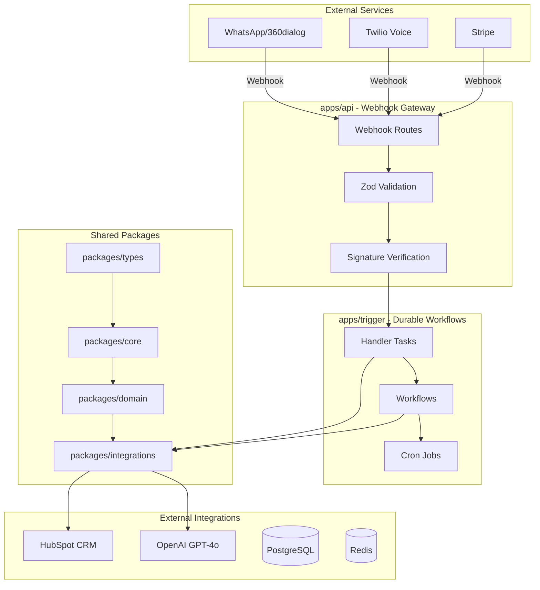
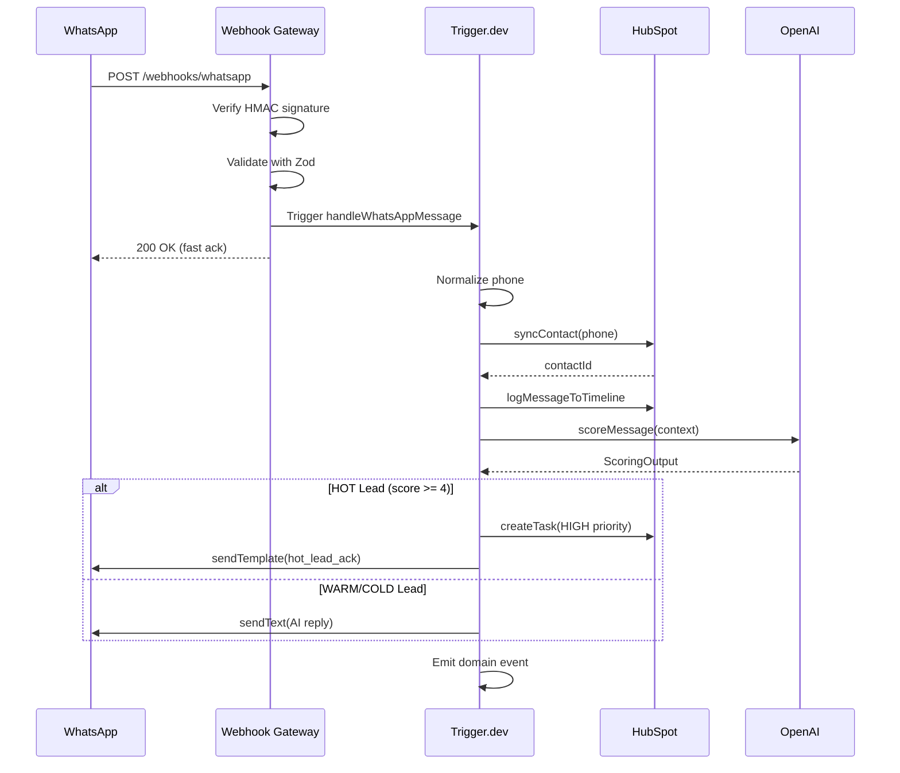
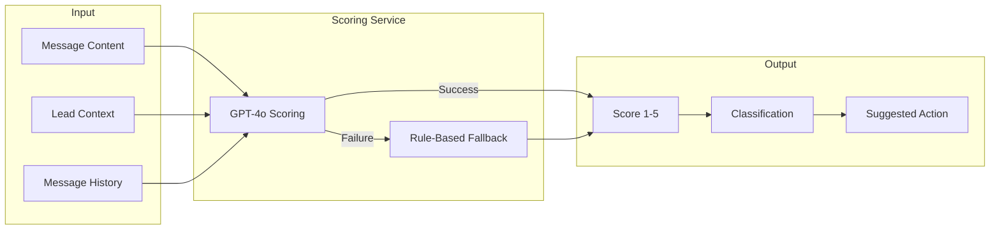
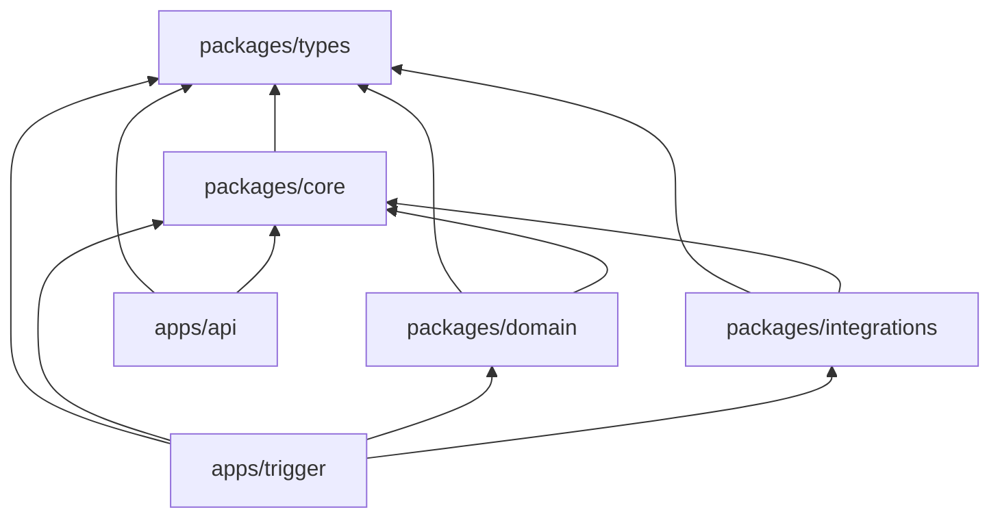
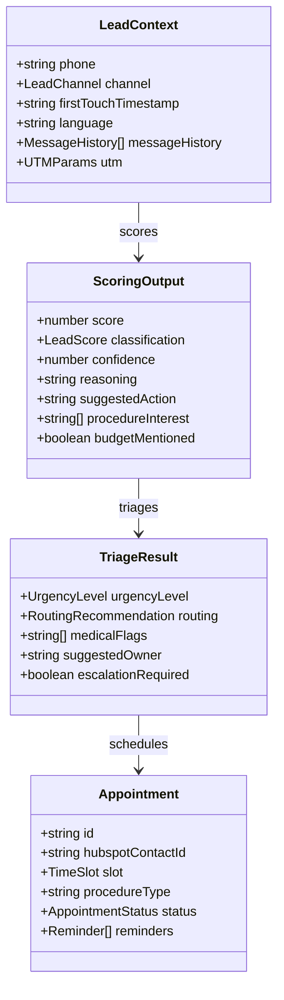

# MedicalCor Architecture

## System Overview

MedicalCor is a medical CRM platform for dental clinics, featuring AI-powered lead scoring, omnichannel communication, and durable workflow processing.



## Event Flow

### WhatsApp Message Flow



### Lead Scoring Flow



## Package Dependencies



## Domain Model



## Cron Jobs Schedule

| Job                       | Schedule     | Description                  |
| ------------------------- | ------------ | ---------------------------- |
| `daily-recall-check`      | 09:00 daily  | Find patients due for recall |
| `appointment-reminders`   | Every hour   | Send 24h/2h reminders        |
| `lead-scoring-refresh`    | 02:00 daily  | Re-score stale leads         |
| `weekly-analytics-report` | 08:00 Monday | Generate metrics report      |
| `stale-lead-cleanup`      | 03:00 Sunday | Archive inactive leads       |
| `gdpr-consent-audit`      | 04:00 daily  | Check expiring consents      |

## Security Considerations

### Webhook Security

- HMAC signature verification for WhatsApp (timing-safe comparison)
- Twilio signature validation via official library
- Stripe signature verification with timing-safe comparison
- Vapi webhook verification with HMAC-SHA256
- All webhooks return 200 quickly, process async
- No signature bypass in any environment (development or production)

### Rate Limiting

- IP-based rate limiting per webhook type
- Configurable limits (WhatsApp: 200/min, Stripe: 50/min, etc.)
- Redis-backed for distributed deployments
- Rate limit headers in responses

### Input Validation

- Zod schema validation on all webhook payloads
- Phone number format validation (E.164)
- Request timeout enforcement (30 seconds)
- Bounded array sizes to prevent memory exhaustion

### Data Protection (GDPR)

- PII redaction in logs (phone, email, message content)
- Consent tracking in database
- Data processor registry maintained
- 2-year consent expiry with renewal flow
- Automated consent audit via cron job

### Secrets Management

- Zod validation on boot
- Production requires all secrets
- Development allows partial config
- Secrets logged as "configured/missing" only

### Error Handling

- React Error Boundaries for graceful UI failures
- Structured error responses with correlation IDs
- No stack traces in production responses

## Database Referential Integrity

### Foreign Key Strategy

MedicalCor uses a hybrid approach to referential integrity that balances data consistency with architectural flexibility:

#### Traditional FK Constraints

Applied to critical relationships where immediate consistency is required:

| Table          | Column                     | References            | On Delete |
| -------------- | -------------------------- | --------------------- | --------- |
| `cases`        | `clinic_id`                | `clinics(id)`         | SET NULL  |
| `cases`        | `lead_id`                  | `leads(id)`           | CASCADE   |
| `cases`        | `treatment_plan_id`        | `treatment_plans(id)` | CASCADE   |
| `payments`     | `case_id`                  | `cases(id)`           | CASCADE   |
| `payments`     | `clinic_id`                | `clinics(id)`         | CASCADE   |
| `leads`        | `clinic_id`                | `clinics(id)`         | SET NULL  |
| `leads`        | `assigned_agent_id`        | `practitioners(id)`   | SET NULL  |
| `interactions` | `lead_id`                  | `leads(id)`           | CASCADE   |
| Audit columns  | `created_by`, `updated_by` | `users(id)`           | SET NULL  |

#### Polymorphic References (No FK)

Used for tables that can reference multiple entity types:

```sql
-- Example: episodic_events uses polymorphic reference
episodic_events (
    subject_type VARCHAR(20),  -- 'lead', 'patient', 'contact'
    subject_id UUID            -- References appropriate table based on subject_type
)
```

**Integrity enforcement for polymorphic references:**

1. **Application-layer validation** via Zod schemas
2. **Service-layer checks** in EpisodeBuilder, GDPR erasure
3. **Trigger.dev workflows** for eventual consistency

#### Event Sourcing Tables (Eventual Consistency)

The `domain_events` table follows append-only semantics for CQRS/ES patterns:

- Events reference entities via `correlation_id` and `payload` JSONB
- FK constraints not applied to maintain append-only performance
- Consistency achieved via event handlers and projections

### Why This Approach?

1. **Performance**: FKs on append-only event stores can cause write contention
2. **Flexibility**: Polymorphic references enable unified event storage across entity types
3. **GDPR Compliance**: Soft delete and subject-centric erasure work across polymorphic references
4. **Scale**: Event-driven projections rebuild state without FK traversal

See `docs/adr/004-cognitive-episodic-memory.md` for full architectural context.

## Infrastructure

### Local Development

```
docker compose up -d
# Starts: API, PostgreSQL, Redis
```

### Production (GCP)

- Cloud Run (auto-scaling API)
- Cloud SQL PostgreSQL (event store)
- Memorystore Redis (rate limiting)
- Secret Manager (credentials)
