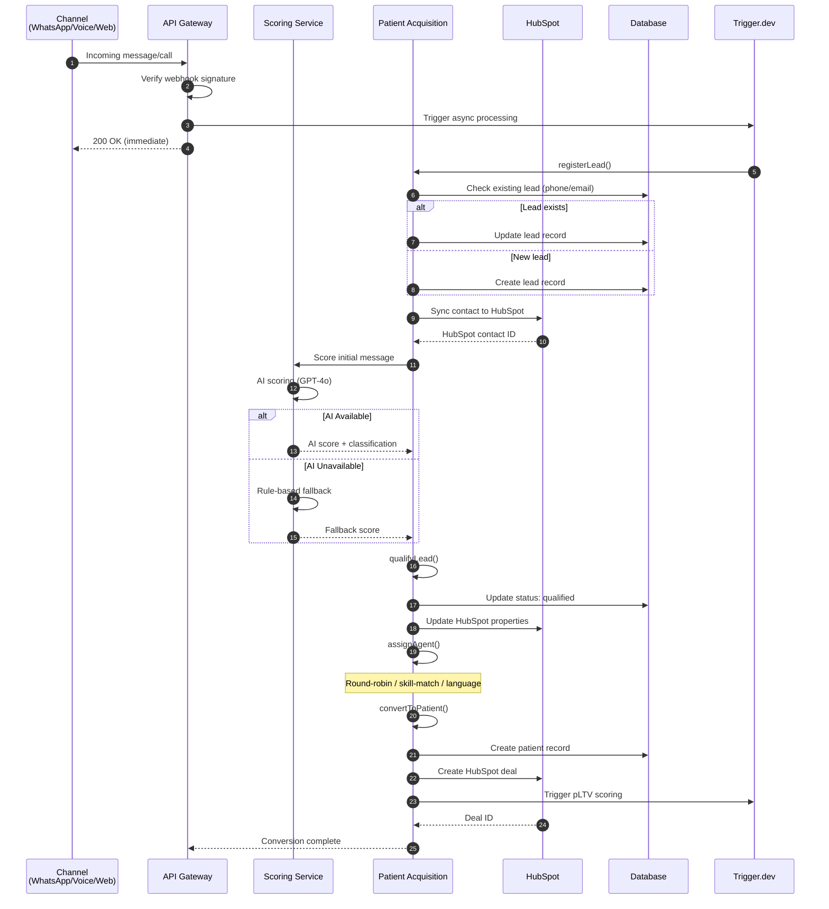
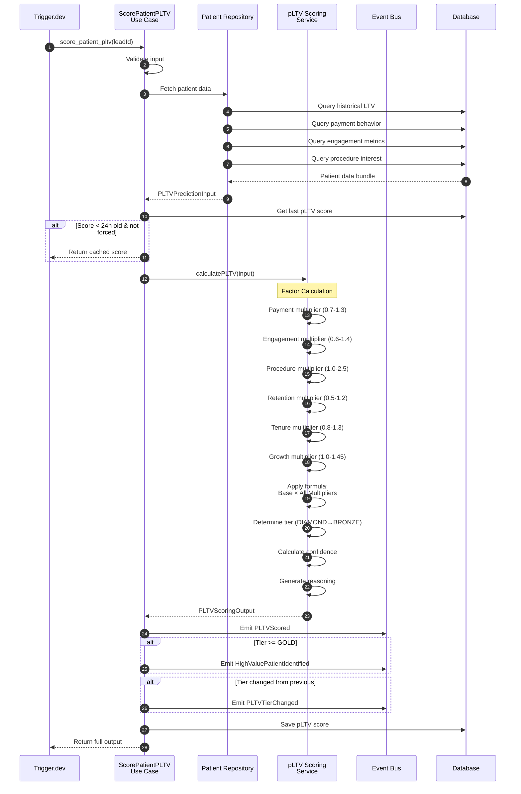
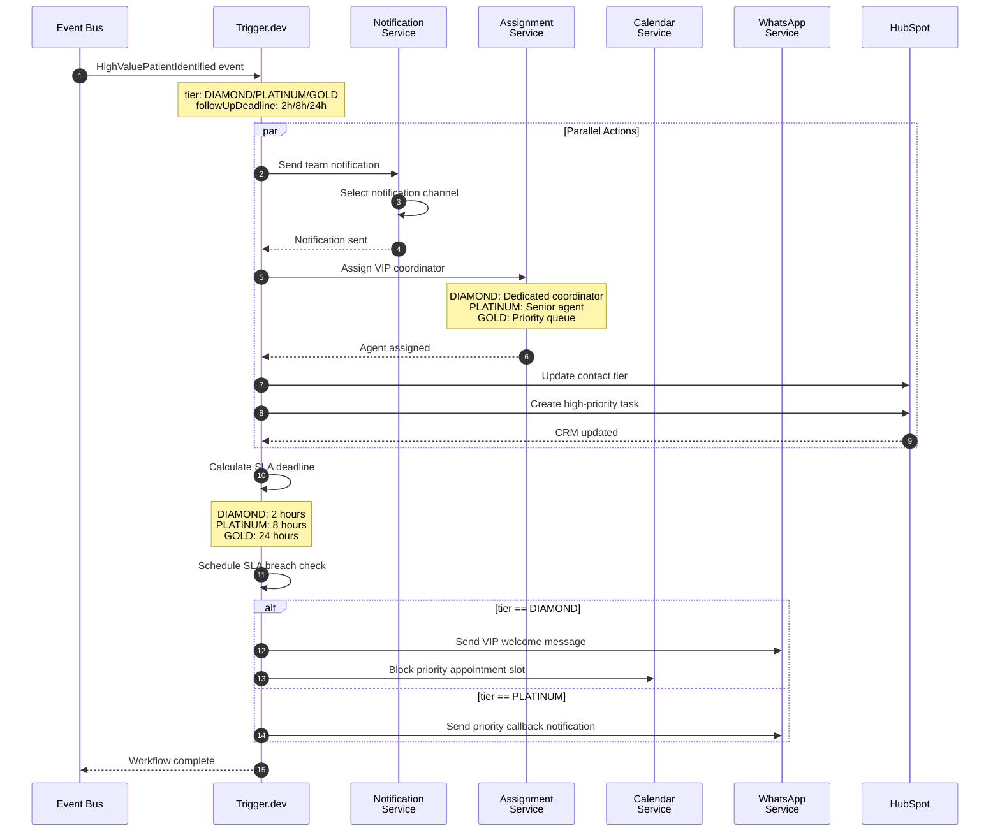
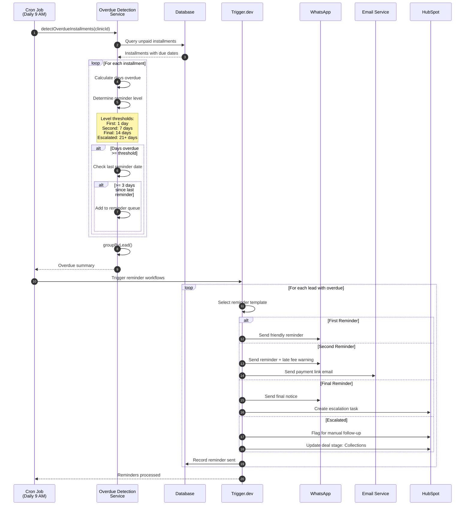
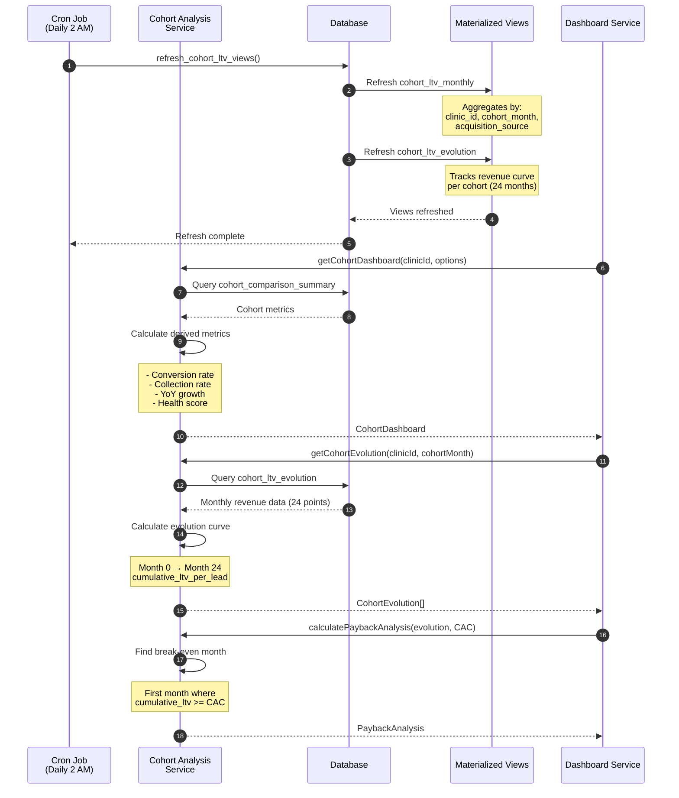

# Business Flow: Lifetime Value (LTV)

Documentation for MedicalCor's Patient Lifetime Value (LTV) business flow, including predicted LTV (pLTV) scoring, cohort analysis, and revenue tracking.

## Table of Contents

- [Overview](#overview)
- [LTV Architecture](#ltv-architecture)
- [Sequence Diagrams](#sequence-diagrams)
  - [Lead-to-Patient Conversion](#lead-to-patient-conversion)
  - [pLTV Scoring Flow](#pltv-scoring-flow)
  - [High-Value Patient Workflow](#high-value-patient-workflow)
  - [Collections Flow](#collections-flow)
  - [Cohort Analysis](#cohort-analysis)
- [LTV Tier System](#ltv-tier-system)
- [Key Components](#key-components)
- [Domain Events](#domain-events)
- [Business Rules](#business-rules)
- [Database Schema](#database-schema)
- [Configuration](#configuration)

---

## Overview

The LTV business flow tracks patient value from initial lead capture through conversion and ongoing treatment. It enables:

- **Predictive Scoring**: ML-based pLTV prediction for prioritizing high-value leads
- **Tier Classification**: DIAMOND/PLATINUM/GOLD/SILVER/BRONZE segmentation
- **SLA-Based Follow-up**: Automated deadlines based on patient value tier
- **Cohort Analysis**: Revenue tracking by acquisition month
- **Collections Automation**: Escalating payment reminders

### Why LTV Matters

| Challenge               | Solution                                     |
| ----------------------- | -------------------------------------------- |
| Limited sales resources | Prioritize high-LTV leads                    |
| Unknown patient value   | Predict future value from behavioral signals |
| Inconsistent follow-up  | SLA-driven response times by tier            |
| Revenue leakage         | Automated collections workflows              |
| Marketing ROI unclear   | Cohort analysis by acquisition source        |

---

## LTV Architecture

```
┌─────────────────────────────────────────────────────────────────────────────┐
│                           LTV SYSTEM ARCHITECTURE                           │
├─────────────────────────────────────────────────────────────────────────────┤
│                                                                             │
│  ┌──────────────┐    ┌──────────────┐    ┌──────────────┐                  │
│  │   Lead       │───▶│   Scoring    │───▶│   Patient    │                  │
│  │   Capture    │    │   Service    │    │   Acquisition│                  │
│  └──────────────┘    └──────────────┘    └──────┬───────┘                  │
│                                                  │                          │
│                                                  ▼                          │
│  ┌─────────────────────────────────────────────────────────────┐           │
│  │                    Case & Revenue Tracking                   │           │
│  │  ┌────────────┐  ┌────────────┐  ┌────────────────────────┐ │           │
│  │  │ Treatment  │  │  Payment   │  │      Collections       │ │           │
│  │  │   Cases    │  │  Records   │  │ (Overdue Detection)    │ │           │
│  │  └────────────┘  └────────────┘  └────────────────────────┘ │           │
│  └─────────────────────────────────────────────────────────────┘           │
│                                    │                                        │
│                                    ▼                                        │
│  ┌─────────────────────────────────────────────────────────────┐           │
│  │                      LTV Calculation Layer                   │           │
│  │  ┌────────────┐  ┌────────────┐  ┌────────────────────────┐ │           │
│  │  │ Historical │  │    pLTV    │  │   Cohort Analysis      │ │           │
│  │  │    LTV     │  │  Scoring   │  │      Service           │ │           │
│  │  └────────────┘  └────────────┘  └────────────────────────┘ │           │
│  └─────────────────────────────────────────────────────────────┘           │
│                                    │                                        │
│                                    ▼                                        │
│  ┌─────────────────────────────────────────────────────────────┐           │
│  │                      Tier & Actions Layer                    │           │
│  │  ┌────────────┐  ┌────────────┐  ┌────────────────────────┐ │           │
│  │  │   Tier     │  │    SLA     │  │   Recommended          │ │           │
│  │  │ Assignment │  │  Deadlines │  │      Actions           │ │           │
│  │  └────────────┘  └────────────┘  └────────────────────────┘ │           │
│  └─────────────────────────────────────────────────────────────┘           │
│                                    │                                        │
│                                    ▼                                        │
│  ┌─────────────────────────────────────────────────────────────┐           │
│  │                     Analytics & Reporting                    │           │
│  │  ┌────────────┐  ┌────────────┐  ┌────────────────────────┐ │           │
│  │  │ Dashboard  │  │  Revenue   │  │   Segment              │ │           │
│  │  │   Stats    │  │   Trends   │  │   Distribution         │ │           │
│  │  └────────────┘  └────────────┘  └────────────────────────┘ │           │
│  └─────────────────────────────────────────────────────────────┘           │
│                                                                             │
└─────────────────────────────────────────────────────────────────────────────┘
```

---

## Sequence Diagrams

### Lead-to-Patient Conversion

The complete journey from lead acquisition to patient conversion:



### pLTV Scoring Flow

Predicted Lifetime Value calculation with factor analysis:



### High-Value Patient Workflow

Triggered when a GOLD+ tier patient is identified:



### Collections Flow

Automated payment reminder escalation:



### Cohort Analysis

Monthly cohort LTV tracking and comparison:



---

## LTV Tier System

### Tier Definitions

| Tier         | pLTV Range        | % of Patients | Investment Priority |
| ------------ | ----------------- | ------------- | ------------------- |
| **DIAMOND**  | > €50,000         | ~5%           | PRIORITATE_MAXIMA   |
| **PLATINUM** | €30,000 - €50,000 | ~10%          | PRIORITATE_RIDICATA |
| **GOLD**     | €15,000 - €30,000 | ~15%          | PRIORITATE_MEDIE    |
| **SILVER**   | €5,000 - €15,000  | ~30%          | PRIORITATE_SCAZUTA  |
| **BRONZE**   | < €5,000          | ~40%          | PRIORITATE_SCAZUTA  |

### SLA Response Times

| Tier     | Follow-up SLA | Contact Method                 |
| -------- | ------------- | ------------------------------ |
| DIAMOND  | 2 hours       | Personal call from coordinator |
| PLATINUM | 8 hours       | Priority callback              |
| GOLD     | 24 hours      | Same-day callback              |
| SILVER   | 72 hours      | Standard follow-up             |
| BRONZE   | 72 hours      | Automated nurture              |

### Recommended Actions by Tier

```
DIAMOND (>€50k)
├── Assign dedicated patient coordinator
├── Priority scheduling for all appointments
├── Personalized treatment plan presentation
├── Direct line to clinic director
└── Complimentary premium services

PLATINUM (€30-50k)
├── Personal welcome call from senior staff
├── Priority appointment slots
├── Personalized treatment recommendations
└── VIP waiting room access

GOLD (€15-30k)
├── Priority callback within 24 hours
├── Comprehensive treatment plan
├── Flexible financing options
└── Regular check-in calls

SILVER (€5-15k)
├── Standard follow-up sequence
├── Educational content delivery
├── Promotional offers
└── Recall reminders

BRONZE (<€5k)
├── Automated nurture campaigns
├── Seasonal promotional outreach
├── Re-engagement campaigns
└── Basic recall reminders
```

---

## Key Components

### Service Layer

| Component                     | Path                                                   | Purpose                       |
| ----------------------------- | ------------------------------------------------------ | ----------------------------- |
| **pLTV Scoring Service**      | `packages/domain/src/ltv/pltv-scoring-service.ts`      | Calculate predicted LTV       |
| **LTV Service**               | `packages/domain/src/ltv/ltv-service.ts`               | Dashboard metrics & analytics |
| **Cohort Analysis Service**   | `packages/domain/src/ltv/cohort-analysis-service.ts`   | Cohort LTV tracking           |
| **Overdue Detection Service** | `packages/domain/src/ltv/overdue-detection-service.ts` | Collections automation        |
| **Lead Scoring Service**      | `packages/domain/src/scoring/scoring-service.ts`       | Initial lead classification   |

### Use Cases

| Component               | Path                                                                  | Purpose                  |
| ----------------------- | --------------------------------------------------------------------- | ------------------------ |
| **Score Patient pLTV**  | `packages/domain/src/ltv/use-cases/score-patient-pltv.ts`             | Orchestrate pLTV scoring |
| **Patient Acquisition** | `packages/application/src/ports/primary/PatientAcquisitionUseCase.ts` | Lead-to-patient pipeline |

### Value Objects

| Component        | Path                                                               | Purpose                       |
| ---------------- | ------------------------------------------------------------------ | ----------------------------- |
| **PredictedLTV** | `packages/domain/src/shared-kernel/value-objects/predicted-ltv.ts` | Immutable pLTV representation |

---

## Domain Events

### pLTV Lifecycle Events

```typescript
// Emitted whenever pLTV is calculated
PLTVScored {
  leadId: string;
  clinicId: string;
  predictedLTV: number;
  previousPLTV?: number;
  tier: PLTVTier;
  growthPotential: GrowthPotential;
  confidence: number;
  reasoning: string;
}

// Triggers VIP workflows for GOLD+ patients
HighValuePatientIdentified {
  leadId: string;
  predictedLTV: number;
  tier: 'DIAMOND' | 'PLATINUM' | 'GOLD';
  followUpDeadline: Date;      // SLA deadline
  recommendedActions: string[];
  patientName?: string;
  phone: string;
}

// Detects tier upgrades/downgrades
PLTVTierChanged {
  leadId: string;
  previousTier: PLTVTier;
  newTier: PLTVTier;
  changePercentage: number;
  direction: 'upgrade' | 'downgrade';
  changeReason: string;
}

// Alerts on significant value decline
PLTVDeclineDetected {
  leadId: string;
  previousPLTV: number;
  currentPLTV: number;
  declinePercentage: number;
  riskFactors: string[];
  recommendedInterventions: string[];
}

// Batch processing events
BatchPLTVScoringStarted {
  batchId: string;
  clinicId: string;
  totalPatients: number;
}

BatchPLTVScoringCompleted {
  batchId: string;
  scored: number;
  highValueCount: number;
  totalPredictedValue: number;
  errors: number;
  durationMs: number;
}
```

---

## Business Rules

### pLTV Calculation Formula

```
Predicted LTV = Base Value
  × Payment Multiplier (0.7-1.3)
  × Engagement Multiplier (0.6-1.4)
  × Procedure Interest Multiplier (1.0-2.5)
  × Retention Multiplier (0.5-1.2)
  × Tenure Multiplier (0.8-1.3)
  × Growth Multiplier (1.0-1.45)
```

### Factor Weights

| Factor                  | Range    | Description                                         |
| ----------------------- | -------- | --------------------------------------------------- |
| **Payment Reliability** | 0.7-1.3  | Based on on-time payment rate                       |
| **Engagement**          | 0.6-1.4  | Appointments kept, referrals, NPS                   |
| **Procedure Interest**  | 1.0-2.5  | All-on-X (2.5x), Implants (1.8x), Full-mouth (2.0x) |
| **Retention**           | 0.5-1.2  | Inverse of churn risk                               |
| **Tenure**              | 0.8-1.3  | Long tenure (365+ days) = 1.3x                      |
| **Growth**              | 1.0-1.45 | Lead source bonus (referral = 1.1x)                 |

### Collections Escalation

| Level         | Days Overdue | Actions                              |
| ------------- | ------------ | ------------------------------------ |
| **First**     | 1 day        | WhatsApp reminder                    |
| **Second**    | 7 days       | WhatsApp + Email + Late fee warning  |
| **Final**     | 14 days      | Final notice + HubSpot task          |
| **Escalated** | 21+ days     | Manual follow-up + Deal stage change |

### Cohort Health Scoring

Health score (0-100) based on:

- Conversion rate weight: 30%
- Collection rate weight: 25%
- Average LTV weight: 25%
- Retention indicators: 20%

---

## Database Schema

### Materialized Views

```sql
-- cohort_ltv_monthly
-- Groups leads by acquisition month
clinic_id, cohort_month, acquisition_source, acquisition_channel
cohort_size, converted_leads, conversion_rate
total_revenue, total_collected, avg_ltv, avg_ltv_converted
collection_rate, avg_days_to_first_case

-- cohort_ltv_evolution
-- Tracks revenue accumulation per cohort
clinic_id, cohort_month, months_since_acquisition
cohort_size, period_revenue, paying_customers
cumulative_revenue, cumulative_ltv_per_lead, paying_percentage

-- cohort_comparison_summary (view)
-- Quick comparison metrics
prev_cohort_avg_ltv, ltv_growth_vs_prev
yoy_cohort_avg_ltv, ltv_growth_yoy
```

### Refresh Schedule

```sql
-- Refresh daily at 2 AM
SELECT refresh_cohort_ltv_views();

-- Query functions
SELECT * FROM get_cohort_ltv_summary(clinic_id, start_month, end_month);
SELECT * FROM get_cohort_ltv_evolution(clinic_id, cohort_month);
```

---

## Configuration

### Default Thresholds

```typescript
const PLTV_CONFIG = {
  // Tier boundaries (EUR)
  tiers: {
    DIAMOND: 50000,
    PLATINUM: 30000,
    GOLD: 15000,
    SILVER: 5000,
    BRONZE: 0,
  },

  // Activity thresholds (days)
  activity: {
    recent: 30,
    inactive: 180,
    longTenure: 365,
  },

  // Confidence thresholds
  confidence: {
    high: 0.8,
    low: 0.5,
  },

  // Rescoring interval
  rescoringIntervalHours: 24,
};
```

### Collections Configuration

```typescript
const COLLECTIONS_CONFIG = {
  // Reminder thresholds (days)
  reminders: {
    first: 1,
    second: 7,
    final: 14,
    escalated: 21,
  },

  // Rate limiting
  minDaysBetweenReminders: 3,
  maxRemindersBeforeEscalation: 3,

  // Late fees
  lateFeeEnabled: true,
  lateFeePercentage: 0.02, // 2%
  lateFeeStartDay: 7,
};
```

---

## Further Reading

- [Workflows Guide](./README/WORKFLOWS.md) - Trigger.dev task patterns
- [Architecture](./ARCHITECTURE.md) - Hexagonal architecture overview
- [API Reference](./README/API_REFERENCE.md) - REST API documentation
- [Monitoring](./README/MONITORING.md) - Metrics and alerting
- [ADR-004: Cognitive Memory](./adr/004-cognitive-episodic-memory.md) - Episodic memory system
