# Call Center & Agent Architecture

## Overview

MedicalCor's Call Center system is an AI-powered contact center platform designed for dental clinics, featuring real-time supervision, intelligent routing, SLA monitoring, and seamless AI-to-human handoff capabilities. Built on hexagonal architecture principles, it integrates with Twilio Flex and Vapi.ai for omnichannel voice operations.

---

## System Architecture

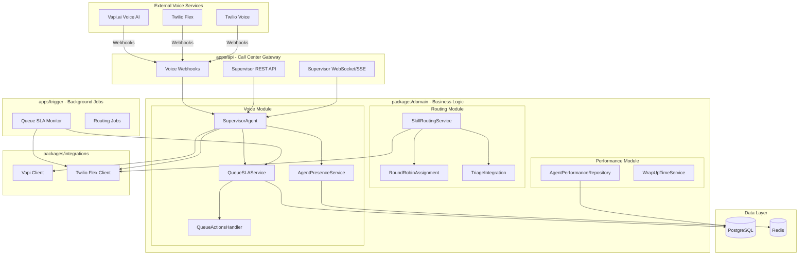

---

## Core Components

### 1. Voice Domain Module

The voice module (`packages/domain/src/voice/`) handles all real-time call center operations.

#### Component Diagram

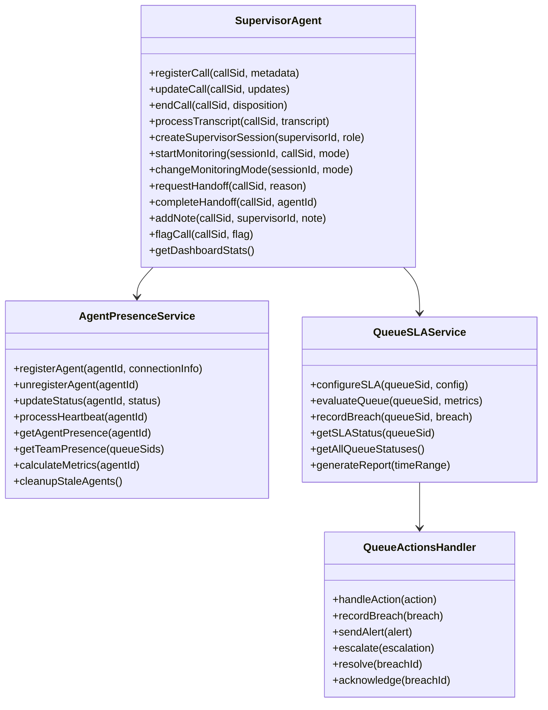

---

### 2. Routing Domain Module

The routing module (`packages/domain/src/routing/`) implements intelligent task and call distribution.

#### Routing Flow

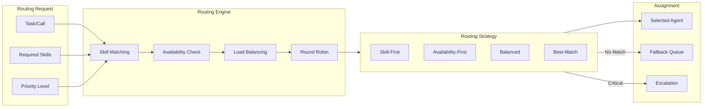

---

## Agent Lifecycle

### State Machine

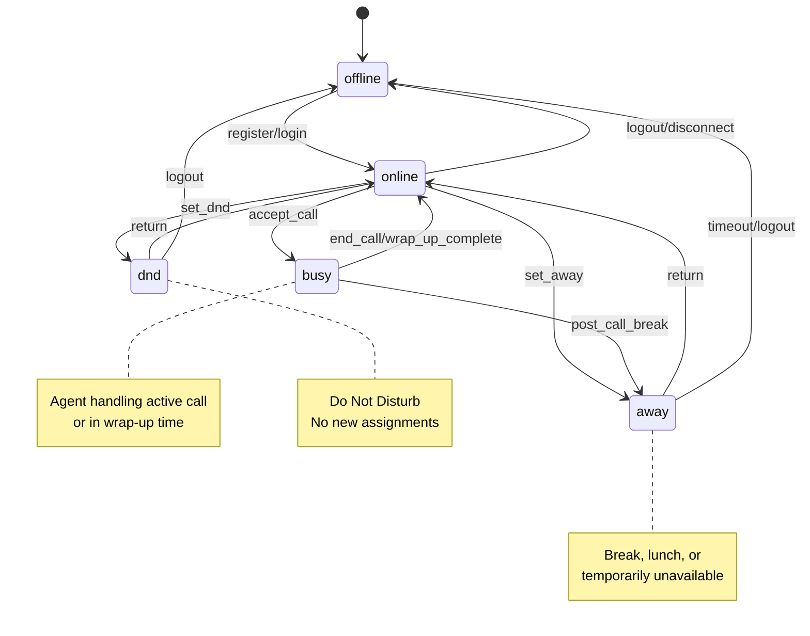

### Agent Presence Events

| Event                  | Trigger             | Action                       |
| ---------------------- | ------------------- | ---------------------------- |
| `agent:registered`     | Login/connect       | Add to available pool        |
| `agent:status_changed` | Status update       | Update routing eligibility   |
| `agent:heartbeat`      | 15s interval        | Confirm connection           |
| `agent:timeout`        | 3 missed heartbeats | Mark offline, reassign tasks |
| `agent:unregistered`   | Logout/disconnect   | Remove from pool             |

---

## Call Supervision

### Supervisor Capabilities

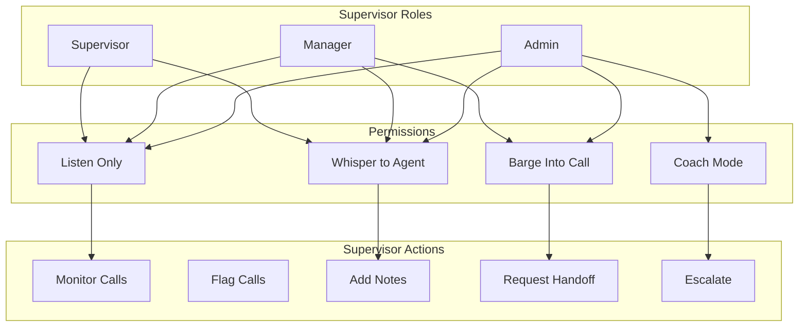

### Call Flags

| Flag                   | Description                    | Auto-Detected |
| ---------------------- | ------------------------------ | ------------- |
| `escalation-requested` | Customer requested supervisor  | Yes           |
| `high-value-lead`      | Lead score >= 4                | Yes           |
| `complaint`            | Customer complaint detected    | Yes           |
| `long-hold`            | Hold time > threshold          | Yes           |
| `silence-detected`     | Extended silence in call       | Yes           |
| `ai-handoff-needed`    | AI unable to handle query      | Yes           |
| `manual-flag`          | Manually flagged by supervisor | No            |

### Escalation Keywords

**English:**

- supervisor, manager, complaint, legal, lawyer, sue, attorney
- terrible, worst, unacceptable, refund, cancel, report

**Romanian:**

- supervizor, manager, reclamație, avocat, proces, inacceptabil
- rambursare, anulare, plângere

---

## AI-to-Human Handoff

### Handoff Flow

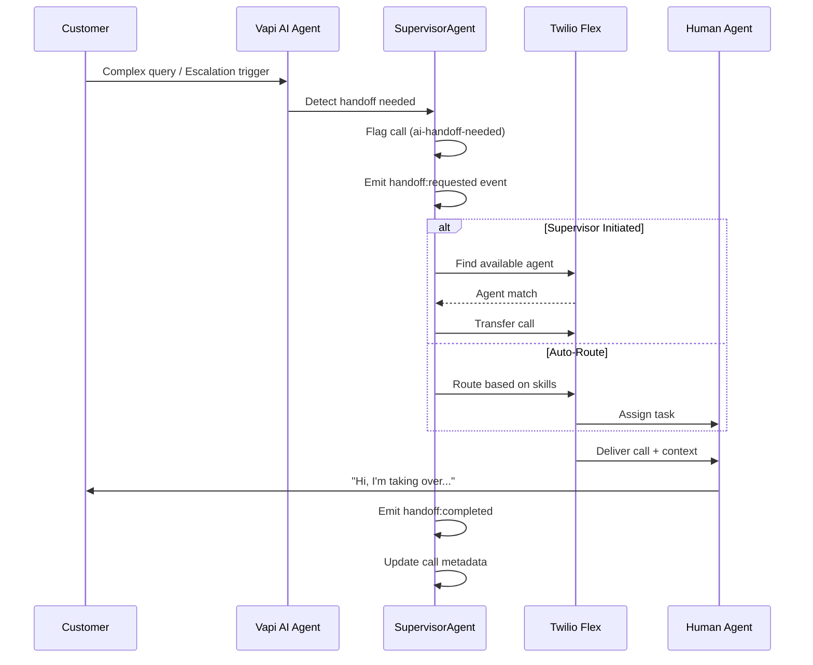

### Handoff Context Passed to Human Agent

```typescript
interface HandoffContext {
  callSid: string;
  customerPhone: string;
  aiTranscript: TranscriptMessage[];
  sentiment: SentimentAnalysis;
  leadScore: number;
  procedureInterest: string[];
  escalationReason: string;
  flags: CallFlag[];
  suggestedActions: string[];
}
```

---

## Queue SLA Management

### SLA Configuration

```typescript
interface QueueSLAConfig {
  queueSid: string;
  queueName: string;

  // Time thresholds (seconds)
  answerTimeThreshold: number; // Target: 30s
  maxWaitTimeWarning: number; // Warning: 120s
  maxWaitTimeCritical: number; // Critical: 300s

  // Performance thresholds
  serviceLevelTarget: number; // Target: 80%
  maxAbandonRate: number; // Max: 5%
  minAgentAvailability: number; // Min: 2 agents

  // Queue size limits
  queueSizeWarning: number; // Warning: 10
  queueSizeCritical: number; // Critical: 25
}
```

### SLA Breach Types

| Breach Type              | Severity         | Trigger          |
| ------------------------ | ---------------- | ---------------- |
| `wait_time_exceeded`     | warning/critical | Wait > threshold |
| `queue_size_exceeded`    | warning/critical | Queue > limit    |
| `abandon_rate_exceeded`  | critical         | Abandon > 5%     |
| `agent_availability_low` | warning          | Available < min  |
| `service_level_missed`   | critical         | SL < target      |

### SLA Monitoring Flow

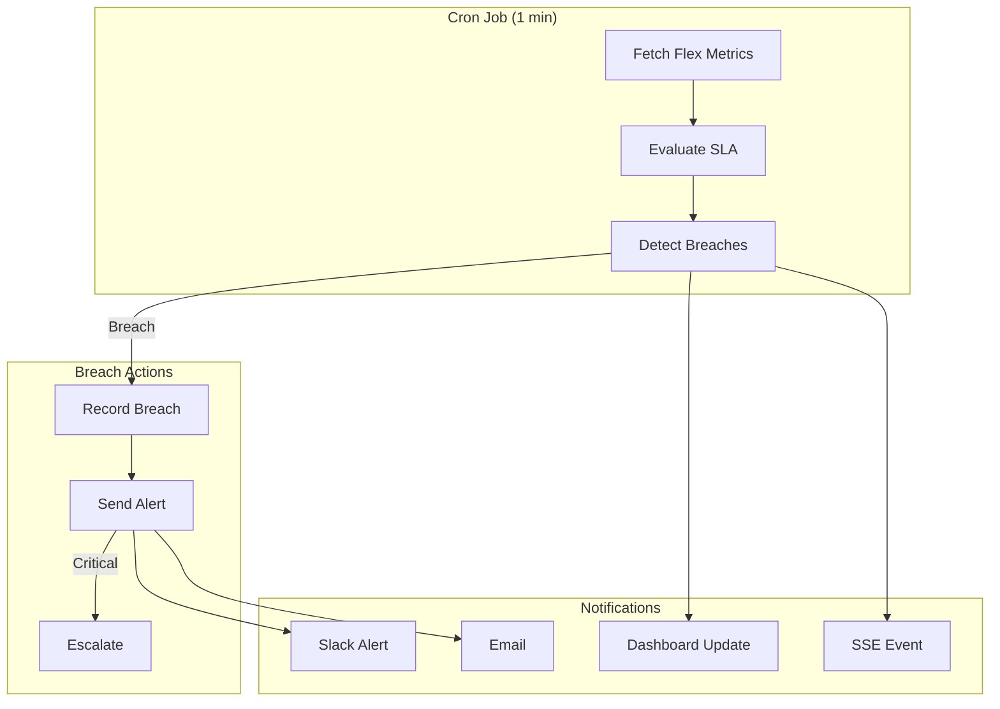

---

## Skill-Based Routing

### Skill Hierarchy

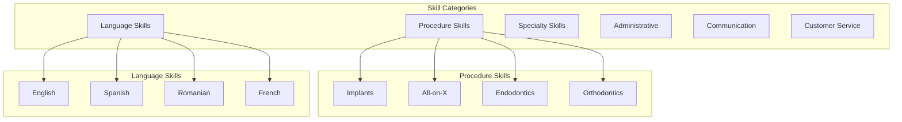

### Proficiency Levels

| Level          | Score Weight | Description                 |
| -------------- | ------------ | --------------------------- |
| `basic`        | 0.25         | Entry level, supervised     |
| `intermediate` | 0.50         | Independent handling        |
| `advanced`     | 0.75         | Complex cases               |
| `expert`       | 1.00         | Training others, edge cases |

### Routing Strategies

| Strategy             | Description                              | Use Case               |
| -------------------- | ---------------------------------------- | ---------------------- |
| `skill-first`        | Prioritize skill match over availability | Specialized procedures |
| `availability-first` | Prioritize available agents              | High volume periods    |
| `balanced`           | Equal weight to skills and availability  | Default routing        |
| `best-match`         | Highest combined score                   | VIP/high-value leads   |

### Match Scoring Algorithm

```typescript
function calculateMatchScore(agent: Agent, task: Task): number {
  let score = 0;

  // Skill proficiency (0-40 points)
  for (const required of task.requiredSkills) {
    const agentSkill = agent.skills.find((s) => s.skillId === required.skillId);
    if (agentSkill) {
      score += agentSkill.proficiency * 10 * required.weight;
    }
  }

  // Availability bonus (0-20 points)
  if (agent.status === 'online') score += 20;
  else if (agent.status === 'away') score += 5;

  // Workload factor (0-20 points)
  const utilization = agent.metrics.utilizationPercent;
  score += (100 - utilization) * 0.2;

  // Recent performance (0-20 points)
  score += agent.metrics.customerSatisfaction * 4;

  return Math.min(100, score);
}
```

---

## Real-Time Communication

### WebSocket/SSE Events

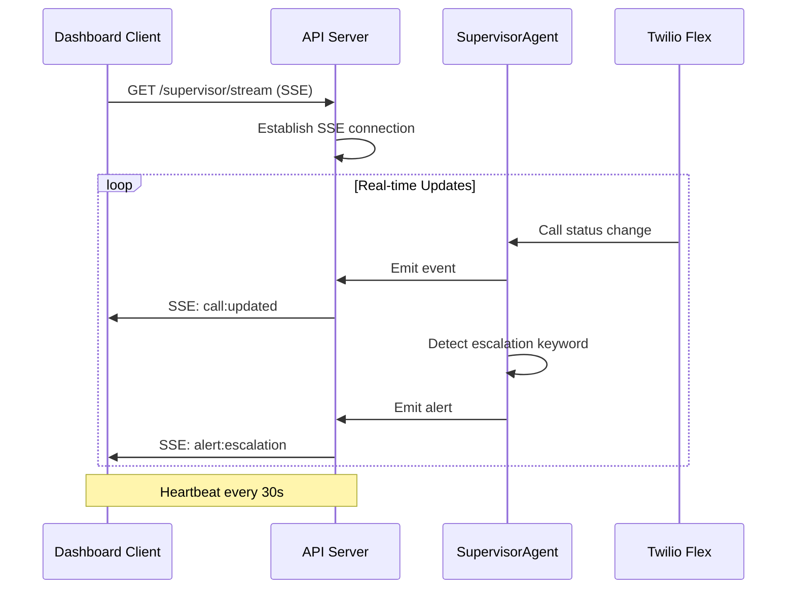

### Event Types

| Event                  | Payload           | Description                   |
| ---------------------- | ----------------- | ----------------------------- |
| `call:started`         | CallMetadata      | New call registered           |
| `call:updated`         | CallUpdate        | Call state/sentiment changed  |
| `call:ended`           | CallDisposition   | Call completed                |
| `transcript:message`   | TranscriptMessage | New transcript line           |
| `alert:escalation`     | EscalationAlert   | Escalation triggered          |
| `supervisor:joined`    | SessionInfo       | Supervisor started monitoring |
| `handoff:requested`    | HandoffRequest    | AI-to-human handoff initiated |
| `handoff:completed`    | HandoffComplete   | Handoff successful            |
| `sla:breach`           | BreachEvent       | SLA threshold exceeded        |
| `agent:status_changed` | PresenceUpdate    | Agent availability changed    |

---

## API Reference

### Supervisor REST Endpoints

| Method   | Endpoint                             | Description                      |
| -------- | ------------------------------------ | -------------------------------- |
| `GET`    | `/supervisor/dashboard`              | Real-time stats and active calls |
| `POST`   | `/supervisor/sessions`               | Create supervisor session        |
| `GET`    | `/supervisor/sessions/:id`           | Get session details              |
| `DELETE` | `/supervisor/sessions/:id`           | End session                      |
| `POST`   | `/supervisor/calls/:callSid/monitor` | Start monitoring                 |
| `DELETE` | `/supervisor/calls/:callSid/monitor` | Stop monitoring                  |
| `POST`   | `/supervisor/calls/:callSid/mode`    | Change monitoring mode           |
| `POST`   | `/supervisor/calls/:callSid/notes`   | Add note to call                 |
| `POST`   | `/supervisor/calls/:callSid/flag`    | Flag call                        |
| `POST`   | `/supervisor/calls/:callSid/handoff` | Request handoff                  |
| `PUT`    | `/supervisor/queue-sla/:queueSid`    | Update SLA config                |
| `GET`    | `/supervisor/queue-sla/status`       | Get all queue SLA statuses       |
| `GET`    | `/supervisor/queue-sla/breaches`     | Get breach history               |

### Dashboard Stats Response

```typescript
interface DashboardStats {
  activeCalls: number;
  activeAlerts: number;
  pendingEscalations: number;
  pendingHandoffs: number;
  agentsOnline: number;
  agentsBusy: number;
  averageWaitTime: number;
  serviceLevelToday: number;
  calls: MonitoredCall[];
  queueStatuses: QueueSLAStatus[];
}
```

---

## Database Schema

### Entity Relationship Diagram

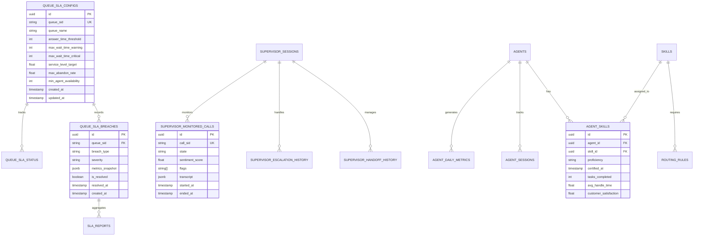

### Key Tables

| Table                           | Purpose                     |
| ------------------------------- | --------------------------- |
| `queue_sla_configs`             | SLA thresholds per queue    |
| `queue_sla_status`              | Real-time queue metrics     |
| `queue_sla_breaches`            | Historical breach events    |
| `sla_reports`                   | Aggregated SLA reports      |
| `supervisor_monitored_calls`    | Active call state           |
| `supervisor_sessions`           | Active monitoring sessions  |
| `supervisor_escalation_history` | Escalation audit trail      |
| `supervisor_handoff_history`    | Handoff audit trail         |
| `agent_daily_metrics`           | Agent performance metrics   |
| `agent_sessions`                | Agent work sessions         |
| `skills`                        | Skill definitions           |
| `agent_skills`                  | Agent-skill assignments     |
| `routing_rules`                 | Routing rule configurations |

---

## Type Definitions

### Agent Presence

```typescript
type AgentPresenceStatus = 'online' | 'offline' | 'busy' | 'away' | 'dnd';

interface AgentPresence {
  agentId: string;
  agentName: string;
  status: AgentPresenceStatus;
  connectionId: string;
  deviceId: string;
  clientType: 'web' | 'mobile' | 'desktop';
  queueSids: string[];
  skills: string[];
  onlineSince: Date | null;
  lastHeartbeat: Date;
  sessionStartedAt: Date | null;
}

interface AgentPresenceMetrics {
  onlineTimeToday: number; // seconds
  busyTimeToday: number; // seconds
  awayTimeToday: number; // seconds
  statusChangesToday: number;
  callsHandledToday: number;
  utilizationPercent: number; // 0-100
}
```

### Skills

```typescript
type SkillCategory =
  | 'procedure'
  | 'language'
  | 'specialty'
  | 'administrative'
  | 'communication'
  | 'customer_service';

type ProficiencyLevel = 'basic' | 'intermediate' | 'advanced' | 'expert';

interface Skill {
  skillId: string;
  name: string;
  category: SkillCategory;
  description?: string;
  requiredCertification?: string;
  parentSkillId?: string;
  childSkillIds?: string[];
}

interface AgentSkill {
  agentId: string;
  skillId: string;
  proficiency: ProficiencyLevel;
  certifiedAt?: Date;
  tasksCompleted: number;
  averageHandleTime: number;
  customerSatisfaction: number;
  lastUsedAt?: Date;
}
```

### Queue Events

```typescript
type QueueBreachType =
  | 'wait_time_exceeded'
  | 'queue_size_exceeded'
  | 'abandon_rate_exceeded'
  | 'agent_availability_low'
  | 'service_level_missed';

type QueueBreachSeverity = 'warning' | 'critical';

interface QueueBreachEvent {
  id: string;
  queueSid: string;
  queueName: string;
  breachType: QueueBreachType;
  severity: QueueBreachSeverity;
  currentValue: number;
  threshold: number;
  metricsSnapshot: QueueMetrics;
  createdAt: Date;
  isResolved: boolean;
  resolvedAt?: Date;
}
```

---

## Integration Clients

### Vapi.ai Client

```typescript
interface VapiClient {
  // Call Management
  createCall(config: CallConfig): Promise<Call>;
  endCall(callSid: string): Promise<void>;
  transferCall(callSid: string, destination: string): Promise<void>;

  // Transcription
  getTranscript(callSid: string): Promise<Transcript>;

  // Webhook Verification
  verifyWebhook(signature: string, payload: string): boolean;

  // Assistant Management
  getAssistant(assistantId: string): Promise<Assistant>;
}
```

### Twilio Flex Client

```typescript
interface FlexClient {
  // Worker Management
  getWorker(workerSid: string): Promise<Worker>;
  updateWorkerActivity(workerSid: string, activitySid: string): Promise<void>;
  getWorkersByQueue(queueSid: string): Promise<Worker[]>;

  // Queue Management
  getQueue(queueSid: string): Promise<Queue>;
  getQueueStatistics(queueSid: string): Promise<QueueStats>;

  // Task Routing
  createTask(queueSid: string, attributes: TaskAttributes): Promise<Task>;
  assignTask(taskSid: string, workerSid: string): Promise<void>;

  // Supervisor Actions
  createConference(callSid: string, mode: MonitorMode): Promise<Conference>;
  joinConference(conferenceSid: string, options: JoinOptions): Promise<void>;

  // Activity Management
  getActivities(): Promise<Activity[]>;
}
```

---

## Background Jobs

### Queue SLA Monitor

**Schedule:** Every 1 minute

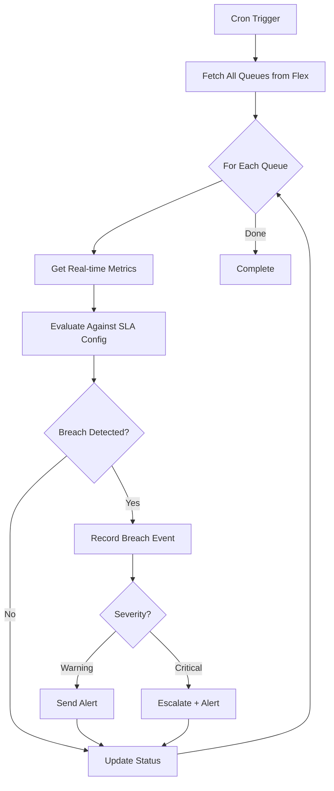

---

## Security & Compliance

### PII Handling

All call center data follows HIPAA/GDPR requirements:

```typescript
// Automatic PII redaction in logs and SSE events
const redactedTranscript = redactPII(transcript, {
  phone: true,
  email: true,
  ssn: true,
  creditCard: true,
  names: true,
});

// Audit trail for supervisor actions
logger.info(
  {
    action: 'supervisor:listen',
    supervisorId: 'sup_123',
    callSid: 'CA_xxx',
    // No customer PII logged
  },
  'Supervisor started listening'
);
```

### Role-Based Access Control

| Role       | Listen | Whisper | Barge | Coach | SLA Config | Reports      |
| ---------- | ------ | ------- | ----- | ----- | ---------- | ------------ |
| Supervisor | ✓      | ✓       | -     | -     | Read       | Own Team     |
| Manager    | ✓      | ✓       | ✓     | -     | Read/Write | All Teams    |
| Admin      | ✓      | ✓       | ✓     | ✓     | Full       | All + Export |

### Audit Requirements

- All supervisor actions logged with correlation IDs
- Call recordings stored encrypted (AES-256)
- Transcript access logged per user
- SLA breach history retained 2 years
- Monthly compliance reports generated automatically

---

## Deployment Milestones

| Milestone | Feature                        | Status | Package Location                                   |
| --------- | ------------------------------ | ------ | -------------------------------------------------- |
| W3        | Voice AI + Realtime Supervisor | ~50%   | `domain/voice/supervisor-agent.ts`                 |
| H6        | Intelligent Agent Routing      | ~70%   | `domain/routing/skill-routing-service.ts`          |
| H8        | Queue SLA Tracking             | ~85%   | `domain/voice/queue-sla-service.ts`                |
| M2        | Agent Presence WebSocket       | ~85%   | `domain/voice/agent-presence-service.ts`           |
| M7        | Round-Robin Assignment         | ~80%   | `domain/routing/round-robin-assignment-service.ts` |

---

## File Structure

```
packages/domain/src/
├── voice/
│   ├── supervisor-agent.ts           # Core supervision logic
│   ├── agent-presence-service.ts     # Real-time presence tracking
│   ├── queue-sla-service.ts          # SLA monitoring
│   ├── queue-actions-handler.ts      # Breach handling
│   ├── presence-websocket-manager.ts # WebSocket management
│   └── supervisor-state-repository.ts # State persistence
├── routing/
│   ├── skill-routing-service.ts      # Skill-based routing
│   ├── round-robin-assignment-service.ts # Load balancing
│   ├── flex-routing-adapter.ts       # Twilio Flex integration
│   ├── triage-integration.ts         # Triage-based routing
│   └── commands.ts                   # CQRS commands
└── agent-performance/
    ├── agent-performance-repository.ts # Performance metrics
    └── wrap-up-time-service.ts       # Post-call tracking

packages/integrations/src/
├── vapi.ts                           # Vapi.ai client
└── flex.ts                           # Twilio Flex client

apps/api/src/routes/
├── supervisor.ts                     # REST API
└── supervisor-ws.ts                  # WebSocket/SSE

apps/trigger/src/jobs/
└── queue-sla-monitor.ts              # Background monitoring

apps/web/src/app/queues/
└── page.tsx                          # Queue dashboard

packages/types/src/schemas/
├── agent-presence.ts                 # Presence types
├── agent-skills.ts                   # Skill types
└── queue.ts                          # Queue event types

supabase/migrations/
├── 20251206000002_supervisor_state_persistence.sql
├── 20251206000021_queue_sla.sql
├── 20251206000023_agent_performance_metrics.sql
└── 20251207000001_agent_wrap_up_time_tracking.sql
```

---

## Related Documentation

- [Main Architecture](./ARCHITECTURE.md)
- [ADR-001: Hexagonal Architecture](./adr/001-hexagonal-architecture.md)
- [ADR-004: Cognitive Episodic Memory](./adr/004-cognitive-episodic-memory.md)
- [Workflows Guide](./README/WORKFLOWS.md)
- [API Reference](./README/API_REFERENCE.md)
- [Security Guide](./README/SECURITY.md)
