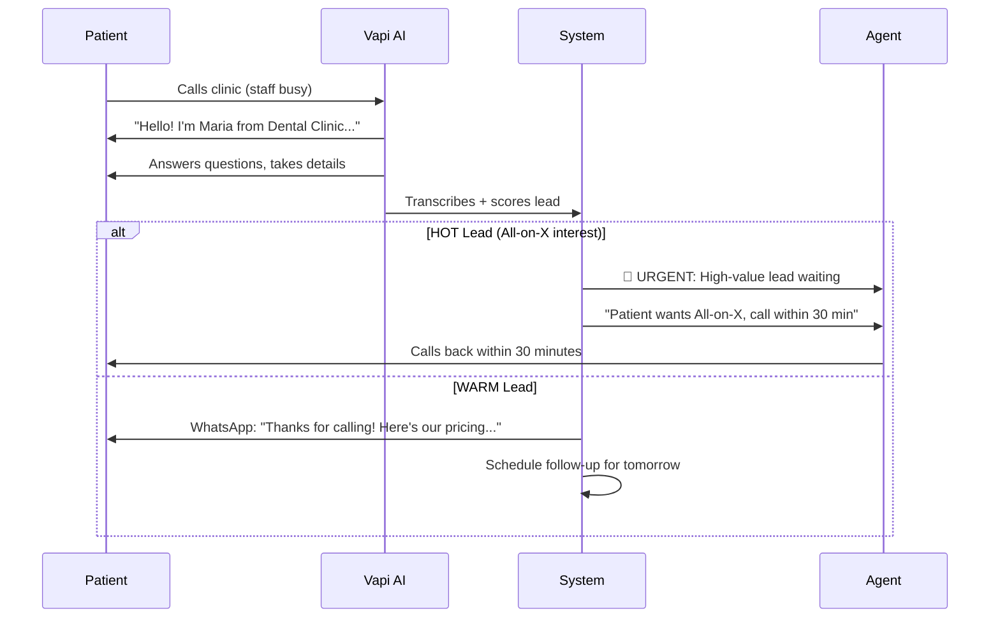
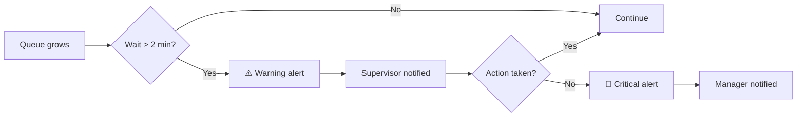

# Call Center & Agent System: Real Value for Dental Clinics

## Design Principle #1: Kindergarten Simple

> **If a receptionist needs training to use it, we failed.**

The best software is **invisible**. Staff shouldn't think about the software - they should think about patients.

### What "Kindergarten Simple" Means

```
┌─────────────────────────────────────────────────────────────────┐
│                                                                 │
│   ❌ BAD: Complex interface                                     │
│   ┌─────────────────────────────────────────────────────────┐  │
│   │ Lead ID: 847293 | Status: WARM | Score: 3.2/5          │  │
│   │ Channel: WhatsApp | First Touch: 2024-12-08T14:32:00Z  │  │
│   │ UTM: source=google&medium=cpc&campaign=implants_ro     │  │
│   │ Actions: [Qualify] [Nurture] [Archive] [Export] [...]  │  │
│   └─────────────────────────────────────────────────────────┘  │
│                                                                 │
│   ✅ GOOD: One glance, one action                               │
│   ┌─────────────────────────────────────────────────────────┐  │
│   │                                                         │  │
│   │   🟡 Maria wants implant info                           │  │
│   │      "How much for one implant?"                        │  │
│   │                                                         │  │
│   │   [ 📞 Call Her ]              Waiting: 2 hours         │  │
│   │                                                         │  │
│   └─────────────────────────────────────────────────────────┘  │
│                                                                 │
└─────────────────────────────────────────────────────────────────┘
```

### The 3-Second Rule

Every screen must answer in 3 seconds:
1. **What needs my attention?** (Colors: 🔴 Red = urgent, 🟡 Yellow = soon, 🟢 Green = ok)
2. **What should I do?** (One big button for the main action)
3. **Did it work?** (Instant feedback: ✓ Done!)

### Real UI Examples

**Morning Dashboard - What receptionist sees at 8am:**

```
┌─────────────────────────────────────────────────────────────────┐
│  Good morning, Ana! ☀️                           Monday, Dec 9  │
├─────────────────────────────────────────────────────────────────┤
│                                                                 │
│  🔴 CALL NOW (2)                                               │
│  ┌──────────────────────────────────────────────────────────┐  │
│  │ Maria S. - wants All-on-X pricing     [ 📞 Call ]        │  │
│  │ Ion P. - asked about financing        [ 📞 Call ]        │  │
│  └──────────────────────────────────────────────────────────┘  │
│                                                                 │
│  📅 TODAY'S APPOINTMENTS (8)                    2 unconfirmed  │
│  ┌──────────────────────────────────────────────────────────┐  │
│  │ 9:00  ✅ Andrei M. - Cleaning                            │  │
│  │ 10:00 ✅ Elena R. - Implant consult                      │  │
│  │ 11:00 ⚠️ Pop Ioan - NOT CONFIRMED     [ Send Reminder ]  │  │
│  │ 14:00 ⚠️ Diana C. - NOT CONFIRMED     [ Send Reminder ]  │  │
│  └──────────────────────────────────────────────────────────┘  │
│                                                                 │
│  ✅ ALL GOOD                                                    │
│  └─ No missed calls                                            │
│  └─ No angry patients                                          │
│  └─ Insurance verified for tomorrow                            │
│                                                                 │
└─────────────────────────────────────────────────────────────────┘
```

**When a call comes in - What agent sees:**

```
┌─────────────────────────────────────────────────────────────────┐
│  📞 INCOMING CALL                                               │
├─────────────────────────────────────────────────────────────────┤
│                                                                 │
│     Maria Popescu                                               │
│     0722 *** **89                                               │
│                                                                 │
│     🟡 WARM LEAD - Interested in implants                       │
│     Last contact: Asked about pricing 3 days ago                │
│                                                                 │
│  ┌──────────────────────────────────────────────────────────┐  │
│  │  💡 TIP: She asked about All-on-X last time.             │  │
│  │     Mention our financing options!                       │  │
│  └──────────────────────────────────────────────────────────┘  │
│                                                                 │
│            [ 🟢 Answer ]         [ 🔴 Decline ]                │
│                                                                 │
└─────────────────────────────────────────────────────────────────┘
```

**After the call - One tap to finish:**

```
┌─────────────────────────────────────────────────────────────────┐
│  Call ended with Maria Popescu                    Duration: 4m  │
├─────────────────────────────────────────────────────────────────┤
│                                                                 │
│  What happened?                                                 │
│                                                                 │
│  [ 📅 Booked appointment ]     ← Most common, biggest button   │
│                                                                 │
│  [ 📞 Call back later ]        [ ❌ Not interested ]           │
│                                                                 │
│  [ 📝 Add note... ]                                            │
│                                                                 │
└─────────────────────────────────────────────────────────────────┘

          ↓ Tap "Booked appointment" ↓

┌─────────────────────────────────────────────────────────────────┐
│  When?                                                          │
├─────────────────────────────────────────────────────────────────┤
│                                                                 │
│  Tomorrow          Thursday         Friday                      │
│  [ 9:00 ]          [ 9:00 ]         [ 9:00 ]                   │
│  [ 10:00 ]         [ 10:00 ]        [ 10:00 ]                  │
│  [ 14:00 ]         [ 14:00 ]        [ 14:00 ]                  │
│                                                                 │
│  ← Only shows AVAILABLE slots. No conflicts possible.          │
│                                                                 │
└─────────────────────────────────────────────────────────────────┘

          ↓ Tap any slot ↓

┌─────────────────────────────────────────────────────────────────┐
│                                                                 │
│            ✅ Done!                                             │
│                                                                 │
│     Maria booked for Thursday 10:00                             │
│     Confirmation sent to her WhatsApp                           │
│                                                                 │
│              [ OK ]                                             │
│                                                                 │
└─────────────────────────────────────────────────────────────────┘
```

### No Training Required

| Action | How Staff Does It |
|--------|-------------------|
| See hot leads | Red cards at top of screen |
| Call a patient | Tap the phone icon |
| Book appointment | Tap slot on calendar |
| Send reminder | Tap "Send Reminder" button |
| Check if patient confirmed | Green ✅ or Yellow ⚠️ |
| Know if something's wrong | Red banner appears |

### Smart Defaults (Zero Configuration)

The system should **just work** without setup:

```
Default: Send reminder 24h before
Default: Flag lead as HOT if mentions "All-on-X"
Default: Route after-hours to AI
Default: Auto-confirm via WhatsApp
Default: Alert supervisor if wait > 2 min

Staff doesn't configure this.
Staff doesn't even know it's happening.
It just works.
```

### Mobile-First (Because Staff Moves Around)

```
Phone screen at reception desk:

┌─────────────────┐
│  🔴 2 calls     │
│     waiting     │
│                 │
│  [ View ]       │
│                 │
│  ─────────────  │
│                 │
│  Next patient:  │
│  Ion P. - 10:00 │
│  Implant consult│
│                 │
│  [ Check in ]   │
│                 │
└─────────────────┘

That's it. Nothing else needed.
```

### Error Prevention (Not Error Messages)

```
❌ BAD: "Error: Cannot book appointment - slot already taken"

✅ GOOD: Slot simply doesn't appear as an option
         (User can't make the mistake)

❌ BAD: "Warning: Patient has outstanding balance of €450"

✅ GOOD: 💰 icon next to patient name
         Tap to see details if needed

❌ BAD: "Please enter phone in format +40 7XX XXX XXX"

✅ GOOD: System accepts any format, normalizes automatically
         "0722123456" → "+40722123456" (handled silently)
```

### The Grandma Test

> **If my grandmother can't use it, redesign it.**

Every feature must pass:
1. Can a 65-year-old receptionist use it without asking for help?
2. Can someone use it while on the phone with a patient?
3. Can it be used on a busy Monday morning without thinking?

If no → simplify until yes.

---

## The Problem We Solve

Every day, dental clinics **lose money** and **waste staff hours** because:

```
┌─────────────────────────────────────────────────────────────────┐
│  MONEY LOST EVERY MONTH (100-patient clinic)                    │
├─────────────────────────────────────────────────────────────────┤
│  💸 Missed calls when busy → patients go elsewhere    €2,000    │
│  💸 Leads going cold → no follow-up, lost forever     €3,500    │
│  💸 No-shows → empty chairs, wasted time              €2,500    │
│  💸 Patients not returning → silent churn             €4,000    │
│  💸 Premium cases missed → All-on-X not identified    €2,500    │
├─────────────────────────────────────────────────────────────────┤
│  TOTAL MONTHLY LOSS                                  €14,500    │
│  ANNUAL LOSS                                        €174,000    │
└─────────────────────────────────────────────────────────────────┘

┌─────────────────────────────────────────────────────────────────┐
│  STAFF TIME WASTED EVERY MONTH                                  │
├─────────────────────────────────────────────────────────────────┤
│  ⏰ Reminder calls to patients                      20 hours    │
│  ⏰ Following up cold leads                          8 hours    │
│  ⏰ Scheduling/rescheduling                          8 hours    │
│  ⏰ Insurance verification calls                    20 hours    │
│  ⏰ Data entry between systems                       8 hours    │
│  ⏰ Answering same questions                         6 hours    │
├─────────────────────────────────────────────────────────────────┤
│  TOTAL MONTHLY WASTE                                70 hours    │
│  COST @ €15/hour                                    €1,050     │
└─────────────────────────────────────────────────────────────────┘
```

---

## How MedicalCor Makes You Indispensable

### Pain Point #1: "We Miss Calls When Busy"

**The Reality:**
- Receptionist on the phone
- Second call comes in, rings 5 times, voicemail
- Patient hangs up, calls competitor
- Clinic never knows they lost €3,000

**What MedicalCor Does:**



**Result:** Zero missed opportunities. AI answers 24/7, scores every caller, prioritizes hot leads.

---

### Pain Point #2: "Leads Go Cold Because We're Too Busy"

**The Reality:**
- Lead contacts you Thursday: "Interested in implants"
- Friday: Emergency patient, no time to call back
- Monday: You call, they've already booked elsewhere

**What MedicalCor Does:**

```
Thursday 3pm: Lead messages on WhatsApp
  └─ System: Detects "implant" keyword
  └─ System: Scores as WARM (3/5)
  └─ System: Auto-sends: "Thanks! Here's our implant guide..."

Thursday 6pm: No response from lead
  └─ System: Schedules follow-up for Friday 10am

Friday 10am: Automated WhatsApp
  └─ "Hi! Did you get a chance to look at our implant options?"

Friday 11am: Lead responds "Yes, how much?"
  └─ System: Re-scores as HOT (4/5) - budget question!
  └─ System: Creates URGENT task for agent
  └─ Agent gets notification: "Hot lead asking about pricing"
```

**The Scoring That Makes This Work:**

| Signal Detected | Score Impact | Action Triggered |
|-----------------|--------------|------------------|
| "All-on-X" mentioned | +2 → HOT | Priority task, 30-min callback |
| "How much?" (budget) | +1.5 → HOT | Send pricing, urgent follow-up |
| "Pain", "urgent" | +1.5 → HOT | Same-day callback |
| "Just looking" | 0 → WARM | Nurture sequence |
| No response 24h | -0.5 → COLD | Re-engagement workflow |

**Result:** No lead falls through the cracks. System follows up when humans forget.

---

### Pain Point #3: "Patients Don't Show Up"

**The Reality:**
- 30 appointments scheduled this week
- 15% no-show rate = 4-5 empty chairs
- Each empty chair = €500 lost
- Staff called to confirm, 40% didn't answer

**What MedicalCor Does:**

```
48 hours before appointment:
  └─ WhatsApp: "Hi Maria! Confirming your appointment Tuesday 2pm"
  └─ Patient replies: ✅ or ❌

24 hours before:
  └─ If no reply: Second reminder + "Reply YES to confirm"
  └─ If replied NO: Auto-offer alternative slots

2 hours before:
  └─ Final reminder with clinic address + directions

If patient cancels:
  └─ System checks wait-list
  └─ Auto-offers slot to next patient
  └─ Fills the gap, zero revenue lost
```

**No-Show Prediction (Planned):**

```typescript
// System learns patterns:
const riskFactors = {
  newPatient: 1.5,           // New patients cancel 50% more
  fridayAfternoon: 1.3,      // Friday PM = high no-show
  previousNoShows: 2.0,      // History repeats
  weatherAlert: 1.2,         // Bad weather = more cancellations
  daysUntilAppointment: 1.1, // Booked 30+ days ago = risky
};

// High-risk appointments get:
// - Extra confirmation call
// - Overbooking allowed
// - Wait-list ready
```

**Result:** No-show rate drops from 15% to 5%. €2,500/month saved.

---

### Pain Point #4: "Patients Disappear After Treatment"

**The Reality:**
- Patient completes €15,000 All-on-X treatment
- Needs 3-month follow-up (€300)
- Needs 6-month check (€300)
- Clinic forgets, patient forgets
- Patient goes elsewhere next time

**What MedicalCor Does:**

```
Treatment completed → System tracks:
  └─ Follow-up due: 3 months
  └─ Retention score: 85 (healthy)

Day 80 (before 3-month mark):
  └─ WhatsApp: "Hi! Time for your follow-up check"
  └─ Patient books → retention score stays high

No response in 7 days:
  └─ Retention score drops: 85 → 70
  └─ System flags: "At-risk patient"
  └─ Agent gets task: "Call Maria - missing follow-up"

No contact in 30 days:
  └─ Retention score: 55 (churn risk)
  └─ Reactivation campaign triggered
  └─ "We miss you! Book now, get 20% off cleaning"
```

**Retention Scoring:**

| Factor | Impact |
|--------|--------|
| Days since last visit | -1 point per 10 days |
| Canceled appointments | -10 points each |
| Completed treatments | +10 points |
| High lifetime value (>€20K) | +5 points |
| NPS promoter (9-10) | +10 points |
| NPS detractor (0-6) | -20 points |

**Result:** 15% more patients retained. €4,000/month in recovered revenue.

---

### Pain Point #5: "We Miss Premium Cases"

**The Reality:**
- Patient says: "My teeth are a mess, I can't smile"
- Receptionist books them for basic consultation
- Doctor later realizes: This is an All-on-X case (€15,000+)
- But patient already decided clinic is "basic"

**What MedicalCor Does:**

```
Patient message: "I hate my teeth, can't smile at work"

System detects:
  ├─ Keywords: "hate", "can't smile" → Emotional urgency
  ├─ Pattern: Full-mouth concern → All-on-X candidate
  └─ Score: 5/5 HOT + "premium-procedure" flag

Automatic actions:
  ├─ HubSpot: Create HIGH priority task
  ├─ Agent alert: "🔴 Possible All-on-X case"
  ├─ Suggested script: "Have you considered full restoration?"
  └─ WhatsApp: Send All-on-X info packet

Agent sees dashboard:
  ┌────────────────────────────────────────┐
  │ 🔴 HOT LEAD - All-on-X Candidate       │
  │ Patient: Maria S.                      │
  │ Interest: Full restoration             │
  │ Budget signals: Asked about financing  │
  │ Urgency: High (emotional language)     │
  │                                        │
  │ Recommended: Premium consultation      │
  │ LTV potential: €15,000 - €25,000       │
  └────────────────────────────────────────┘
```

**Procedure Detection:**

| Keywords/Patterns | Procedure Flag | LTV Multiplier |
|-------------------|----------------|----------------|
| "all my teeth", "full mouth", "can't eat" | All-on-X | 2.5x |
| "implant", "missing tooth" | Single implant | 1.5x |
| "straighten", "braces", "invisalign" | Orthodontics | 1.8x |
| "whitening", "smile", "wedding" | Cosmetic | 1.3x |

**Result:** Zero missed premium opportunities. €15,000+ cases identified immediately.

---

## Manual Work Eliminated

### Before MedicalCor

```
Monday morning routine:
  8:00 - Check voicemails from weekend (15 min)
  8:15 - Enter new leads into spreadsheet (20 min)
  8:35 - Copy leads to clinic software (15 min)
  8:50 - Call to confirm today's appointments (45 min)
  9:35 - Call insurance for tomorrow's patients (30 min)
  10:05 - Finally can start real work

Total wasted: 2+ hours EVERY MORNING
```

### After MedicalCor

```
Monday morning routine:
  8:00 - Check dashboard (5 min)
        └─ Weekend leads already scored & in CRM
        └─ Appointments auto-confirmed via WhatsApp
        └─ Insurance pre-verified
        └─ Hot leads flagged for immediate callback
  8:05 - Start real work

Total wasted: 5 minutes
```

### Automation Summary

| Task | Before | After | Time Saved |
|------|--------|-------|------------|
| Lead data entry | Manual | Auto-sync to HubSpot | 8 hrs/month |
| Appointment reminders | Phone calls | WhatsApp auto | 20 hrs/month |
| Insurance verification | Phone calls | API integration | 16 hrs/month |
| Lead follow-up | Forget often | Auto-workflows | 8 hrs/month |
| Question answering | Repeat 50x/week | AI handles 40% | 6 hrs/month |
| **TOTAL** | - | - | **58 hrs/month** |

---

## The Supervisor Dashboard: See Everything

Real-time visibility into what's happening:

```
┌─────────────────────────────────────────────────────────────────┐
│  SUPERVISOR DASHBOARD                           Live ●         │
├─────────────────────────────────────────────────────────────────┤
│                                                                 │
│  Active Calls: 3        Waiting: 2        Agents Online: 4     │
│                                                                 │
│  ┌─────────────────────────────────────────────────────────┐   │
│  │ 🔴 ALERT: Call #47 - Escalation keyword detected        │   │
│  │    Patient said: "I want to speak to a manager"         │   │
│  │    [Listen] [Whisper] [Take Over]                       │   │
│  └─────────────────────────────────────────────────────────┘   │
│                                                                 │
│  CALL #45 - Maria S.                    Duration: 4:32         │
│  ├─ Agent: Ana                                                 │
│  ├─ Sentiment: 😊 Positive                                     │
│  ├─ Topic: All-on-X consultation booking                       │
│  └─ Lead Score: 5/5 HOT                                        │
│                                                                 │
│  CALL #46 - Ion P.                      Duration: 2:15         │
│  ├─ Agent: Vapi AI                                             │
│  ├─ Sentiment: 😐 Neutral                                      │
│  ├─ Topic: Appointment confirmation                            │
│  └─ Status: Confirmed for Thursday 2pm                         │
│                                                                 │
│  QUEUE SLA                                                     │
│  ├─ Average Wait: 18s ✅ (target: 30s)                         │
│  ├─ Service Level: 92% ✅ (target: 80%)                        │
│  └─ Abandon Rate: 2% ✅ (target: 5%)                           │
│                                                                 │
└─────────────────────────────────────────────────────────────────┘
```

**Supervisor Powers:**

| Action | What It Does | When to Use |
|--------|--------------|-------------|
| **Listen** | Hear call without patient knowing | Quality monitoring |
| **Whisper** | Talk to agent, patient can't hear | Coach in real-time |
| **Barge** | Join call, take over | Escalation handling |
| **Flag** | Mark call for review | Training material |

---

## Queue SLA: Never Miss Standards

```
Queue: All-on-X Consultations
├─ Target: Answer within 30 seconds
├─ Current: 18 seconds ✅
└─ If breached:
    ├─ Alert supervisor immediately
    ├─ Add extra agent to queue
    └─ Log for weekly report

Queue: General Inquiries
├─ Target: Answer within 60 seconds
├─ Current: 45 seconds ✅
└─ After-hours: Route to Vapi AI
```

**Breach Prevention:**



---

## Agent Performance: Know Who's Winning

```
┌─────────────────────────────────────────────────────────────────┐
│  AGENT PERFORMANCE - This Week                                  │
├─────────────────────────────────────────────────────────────────┤
│                                                                 │
│  Ana M.          ████████████████████ 92%                      │
│  ├─ Calls: 45    ├─ Avg Handle: 4:20    ├─ Conversions: 12     │
│  └─ Hot leads closed: 8/10 (80%)                               │
│                                                                 │
│  Ion P.          ████████████████░░░░ 78%                      │
│  ├─ Calls: 38    ├─ Avg Handle: 5:45    ├─ Conversions: 8      │
│  └─ Hot leads closed: 5/9 (55%) ⚠️ Needs coaching              │
│                                                                 │
│  Vapi AI         ████████████████████ 95%                      │
│  ├─ Calls: 120   ├─ Avg Handle: 2:10    ├─ Transfers: 15       │
│  └─ After-hours handled: 45 (100%)                             │
│                                                                 │
└─────────────────────────────────────────────────────────────────┘
```

---

## ROI Calculator

### For a 100-patient/month clinic:

```
BEFORE MEDICALCOR:
├─ Revenue lost to inefficiency:     €14,500/month
├─ Staff time wasted:                70 hours/month (€1,050)
├─ Missed premium cases:             2-3/month (€30,000+)
└─ TOTAL ANNUAL LOSS:                €180,000+

AFTER MEDICALCOR (Fully Deployed):
├─ Revenue recovered:                €12,000/month
├─ Staff time saved:                 58 hours/month (€870)
├─ Premium cases captured:           +2/month (€30,000)
└─ TOTAL ANNUAL GAIN:                €150,000+

PAYBACK PERIOD: 2-3 months
```

---

## What Makes This Indispensable

### 1. You Can't Go Back

Once you have:
- AI answering calls 24/7
- Automatic lead scoring
- Reminders that work
- Retention tracking

Going back to manual = immediate revenue drop.

### 2. Staff Becomes 3x More Effective

Instead of:
- Making reminder calls
- Entering data
- Chasing cold leads

Staff focuses on:
- Closing hot leads
- Premium consultations
- Patient relationships

### 3. You See What You Were Blind To

```
Before: "I think we're doing okay with leads"
After:  "We have 23 HOT leads, 15 WARM leads aging,
         4 patients at churn risk, 2 premium cases
         waiting for callback"
```

### 4. Competitors Without This Lose

When patient calls your competitor:
- Ring... ring... voicemail
- Maybe callback Monday
- No follow-up

When patient calls you:
- Immediate AI answer
- Scored and prioritized
- Follow-up guaranteed
- Premium cases identified

**Who wins the patient?**

---

## Implementation Priority

### Week 1: Stop the Bleeding

| Deploy | Revenue Impact | Effort |
|--------|----------------|--------|
| AI call answering (Vapi) | +€2,000/month | Ready |
| Lead scoring + alerts | +€3,500/month | Ready |
| HubSpot auto-sync | Save 8 hours | Ready |

### Week 2-3: Prevent Loss

| Deploy | Revenue Impact | Effort |
|--------|----------------|--------|
| Appointment reminders | +€2,500/month | 3 days |
| WhatsApp follow-up workflows | +€2,000/month | 2 days |
| Insurance pre-verification | Save 16 hours | Ready |

### Month 2: Maximize Value

| Deploy | Revenue Impact | Effort |
|--------|----------------|--------|
| Retention scoring + alerts | +€4,000/month | 1 week |
| No-show prediction | +€1,500/month | 4 days |
| Supervisor dashboard | Quality improvement | Ready |

---

## Summary: Why Clinics Can't Live Without This

| Pain Point | Without MedicalCor | With MedicalCor |
|------------|-------------------|-----------------|
| Missed calls | Lost forever | AI answers, lead scored |
| Cold leads | Forgotten | Auto follow-up |
| No-shows | 15% rate, €2,500 lost | 5% rate, reminders work |
| Churn | Silent, unnoticed | Predicted, prevented |
| Premium cases | Missed, misclassified | Detected, prioritized |
| Staff time | 70 hours wasted | 58 hours saved |
| Visibility | Blind | Real-time dashboard |

**The question isn't "Can we afford this?"**

**The question is "Can we afford NOT to have this?"**

---

## Technical Architecture (For Engineers)

See [CALL_CENTER_ARCHITECTURE.md](./CALL_CENTER_ARCHITECTURE.md) for:
- System component diagrams
- API reference
- Database schema
- Integration details
- WebSocket events
