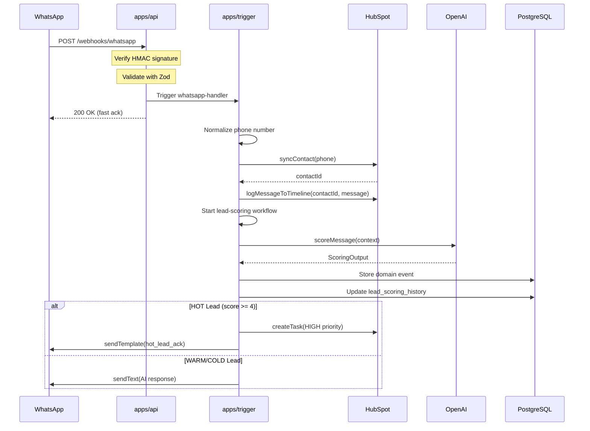
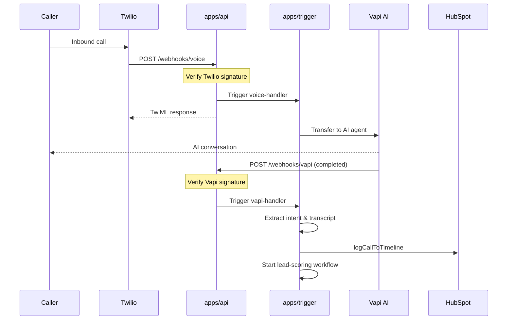
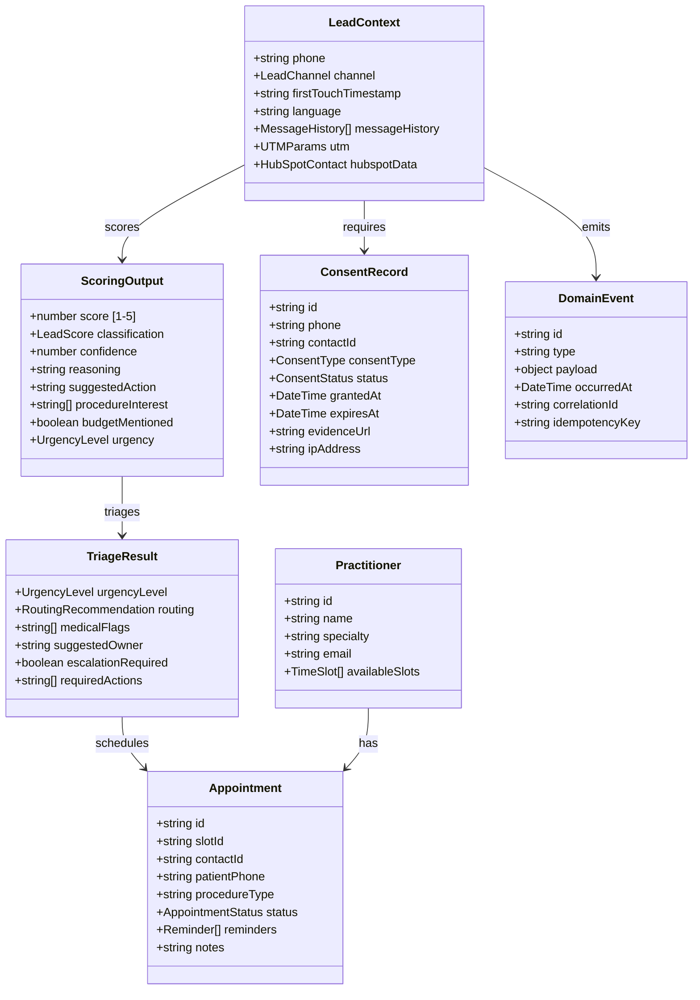
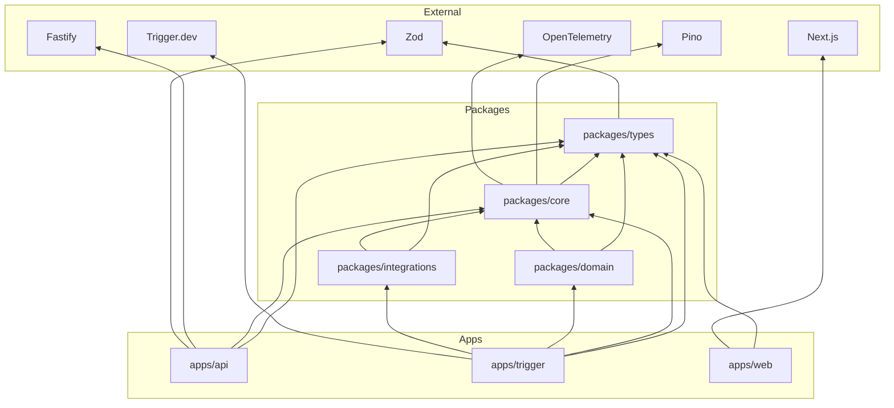

# Architecture

Comprehensive documentation of the MedicalCor Core system architecture.

## Table of Contents

- [System Overview](#system-overview)
- [High-Level Architecture](#high-level-architecture)
- [Component Details](#component-details)
- [Data Flow](#data-flow)
- [Domain Model](#domain-model)
- [Package Dependencies](#package-dependencies)
- [Infrastructure](#infrastructure)
- [Design Decisions](#design-decisions)

---

## System Overview

MedicalCor Core is a medical CRM platform built as a **monorepo** using modern TypeScript and cloud-native patterns. The system follows these architectural principles:

### Core Principles

| Principle | Implementation |
|-----------|----------------|
| **Event-Driven** | All state changes captured as domain events |
| **Durable Workflows** | Background tasks survive failures with automatic retries |
| **Schema-First** | Zod schemas as single source of truth |
| **Security-First** | Signature verification, rate limiting, input validation |
| **Observable** | OpenTelemetry tracing, structured logging, metrics |

### Key Characteristics

```
┌─────────────────────────────────────────────────────────────┐
│                    Design Characteristics                    │
├─────────────────────────────────────────────────────────────┤
│  • Monorepo with clear package boundaries                   │
│  • Event sourcing for audit trail and replay capability     │
│  • AI-powered scoring with rule-based fallback              │
│  • Multi-channel communication (WhatsApp, Voice, Email)     │
│  • GDPR-compliant consent management                        │
│  • Auto-scaling from 0 to N instances                       │
└─────────────────────────────────────────────────────────────┘
```

---

## High-Level Architecture

```
┌─────────────────────────────────────────────────────────────────────────────┐
│                              EXTERNAL SERVICES                               │
├──────────┬──────────┬──────────┬──────────┬──────────┬──────────┬──────────┤
│ WhatsApp │  Twilio  │   Vapi   │  Stripe  │  HubSpot │  OpenAI  │   Web    │
│(360dialog)│  Voice   │ Voice AI │ Payments │   CRM    │  GPT-4o  │ Clients  │
└────┬─────┴────┬─────┴────┬─────┴────┬─────┴────┬─────┴────┬─────┴────┬─────┘
     │          │          │          │          │          │          │
     │ Webhooks │          │          │          │  API     │   API    │
     ▼──────────▼──────────▼──────────▼          ▼──────────▼──────────▼
┌─────────────────────────────────────────────────────────────────────────────┐
│                         apps/api (Fastify Gateway)                           │
│  ┌─────────────────────────────────────────────────────────────────────────┐│
│  │  Security Layer                                                          ││
│  │  ┌──────────────┐ ┌──────────────┐ ┌──────────────┐ ┌──────────────┐   ││
│  │  │   Helmet.js  │ │ Rate Limiter │ │   CORS       │ │  Signature   │   ││
│  │  │  (Headers)   │ │   (Redis)    │ │ Validation   │ │ Verification │   ││
│  │  └──────────────┘ └──────────────┘ └──────────────┘ └──────────────┘   ││
│  └─────────────────────────────────────────────────────────────────────────┘│
│  ┌─────────────────────────────────────────────────────────────────────────┐│
│  │  Request Processing                                                      ││
│  │  ┌──────────────┐ ┌──────────────┐ ┌──────────────┐ ┌──────────────┐   ││
│  │  │ Zod Schema   │ │ Correlation  │ │   Request    │ │    Fast      │   ││
│  │  │ Validation   │ │ ID Tracking  │ │   Timeout    │ │  Acknowledge │   ││
│  │  └──────────────┘ └──────────────┘ └──────────────┘ └──────────────┘   ││
│  └─────────────────────────────────────────────────────────────────────────┘│
└─────────────────────────────────────┬───────────────────────────────────────┘
                                      │
                                      │ Trigger Tasks
                                      ▼
┌─────────────────────────────────────────────────────────────────────────────┐
│                      apps/trigger (Durable Workflows)                        │
│  ┌─────────────────────────────────────────────────────────────────────────┐│
│  │  Task Handlers                                                           ││
│  │  ┌──────────────┐ ┌──────────────┐ ┌──────────────┐ ┌──────────────┐   ││
│  │  │  WhatsApp    │ │    Voice     │ │   Payment    │ │    Vapi      │   ││
│  │  │   Handler    │ │   Handler    │ │   Handler    │ │   Handler    │   ││
│  │  └──────────────┘ └──────────────┘ └──────────────┘ └──────────────┘   ││
│  └─────────────────────────────────────────────────────────────────────────┘│
│  ┌─────────────────────────────────────────────────────────────────────────┐│
│  │  Workflows                                                               ││
│  │  ┌──────────────┐ ┌──────────────┐ ┌──────────────┐ ┌──────────────┐   ││
│  │  │ Lead Scoring │ │   Patient    │ │   Booking    │ │    Voice     │   ││
│  │  │  Workflow    │ │   Journey    │ │    Agent     │ │ Transcription│   ││
│  │  └──────────────┘ └──────────────┘ └──────────────┘ └──────────────┘   ││
│  └─────────────────────────────────────────────────────────────────────────┘│
│  ┌─────────────────────────────────────────────────────────────────────────┐│
│  │  Scheduled Jobs (Cron)                                                   ││
│  │  ┌──────────────┐ ┌──────────────┐ ┌──────────────┐ ┌──────────────┐   ││
│  │  │ Recall Check │ │  Reminders   │ │ Score Refresh│ │ GDPR Audit   │   ││
│  │  │  (09:00)     │ │  (Hourly)    │ │   (02:00)    │ │   (04:00)    │   ││
│  │  └──────────────┘ └──────────────┘ └──────────────┘ └──────────────┘   ││
│  └─────────────────────────────────────────────────────────────────────────┘│
└─────────────────────────────────────┬───────────────────────────────────────┘
                                      │
                                      │ Use
                                      ▼
┌─────────────────────────────────────────────────────────────────────────────┐
│                           Shared Packages                                    │
│  ┌────────────────────┐ ┌────────────────────┐ ┌────────────────────┐       │
│  │   packages/types   │ │   packages/core    │ │  packages/domain   │       │
│  │   ─────────────    │ │   ────────────     │ │  ──────────────    │       │
│  │   • Zod Schemas    │ │   • Logger         │ │  • ScoringService  │       │
│  │   • Type Inference │ │   • Errors         │ │  • TriageService   │       │
│  │   • Validation     │ │   • Auth           │ │  • SchedulingService│      │
│  │                    │ │   • Event Store    │ │  • ConsentService  │       │
│  │                    │ │   • Circuit Breaker│ │                    │       │
│  └────────────────────┘ └────────────────────┘ └────────────────────┘       │
│  ┌────────────────────┐                                                      │
│  │packages/integrations│                                                     │
│  │   ───────────────  │                                                      │
│  │   • HubSpot Client │                                                      │
│  │   • WhatsApp Client│                                                      │
│  │   • OpenAI Client  │                                                      │
│  │   • Stripe Client  │                                                      │
│  │   • Vapi Client    │                                                      │
│  └────────────────────┘                                                      │
└─────────────────────────────────────┬───────────────────────────────────────┘
                                      │
                                      │ Persist
                                      ▼
┌─────────────────────────────────────────────────────────────────────────────┐
│                            Data Layer                                        │
│  ┌─────────────────────────────────┐ ┌─────────────────────────────────┐    │
│  │         PostgreSQL 15           │ │           Redis 7               │    │
│  │  ───────────────────────────    │ │  ───────────────────────────    │    │
│  │  • domain_events (event store)  │ │  • Rate limit counters          │    │
│  │  • consent_records (GDPR)       │ │  • Session cache                │    │
│  │  • appointments                 │ │  • Pub/Sub messaging            │    │
│  │  • message_log (audit)          │ │  • Idempotency keys             │    │
│  │  • lead_scoring_history         │ │                                 │    │
│  │  • practitioners                │ │                                 │    │
│  │  • time_slots                   │ │                                 │    │
│  └─────────────────────────────────┘ └─────────────────────────────────┘    │
└─────────────────────────────────────────────────────────────────────────────┘
```

---

## Component Details

### apps/api - Webhook Gateway

**Purpose**: Primary ingestion point for all external webhooks and API requests.

**Technology**: Fastify 5.x

**Key Features**:
- Fast webhook acknowledgment (<100ms)
- Signature verification for all webhook types
- Rate limiting with Redis backend
- Request correlation tracking
- Health check endpoints for Kubernetes

**Routes**:

| Route | Method | Description |
|-------|--------|-------------|
| `/health` | GET | Basic health check |
| `/ready` | GET | Kubernetes readiness probe |
| `/live` | GET | Kubernetes liveness probe |
| `/webhooks/whatsapp` | GET/POST | WhatsApp webhook |
| `/webhooks/voice` | POST | Twilio voice callbacks |
| `/webhooks/voice/status` | POST | Call status updates |
| `/webhooks/stripe` | POST | Stripe payment events |
| `/webhooks/vapi` | POST | Vapi voice AI callbacks |
| `/workflows/*` | POST | Trigger.dev workflow endpoints |
| `/ai/execute` | POST | AI function execution |

**Security Layers**:

```
Request → Helmet → CORS → Rate Limit → Signature → Validate → Process
                     │         │           │          │
                     ▼         ▼           ▼          ▼
                   Redis    Provider     Zod      Trigger.dev
                            Library    Schema
```

---

### apps/trigger - Durable Workflows

**Purpose**: Background job processing with guaranteed delivery and automatic retries.

**Technology**: Trigger.dev v3.1

**Key Features**:
- Durable execution (survives crashes)
- Automatic retries with exponential backoff
- Event-driven task triggering
- Scheduled cron jobs
- Idempotent processing

**Task Handlers**:

| Task | Trigger | Description |
|------|---------|-------------|
| `whatsapp-handler` | Webhook | Process WhatsApp messages |
| `voice-handler` | Webhook | Handle Twilio voice calls |
| `payment-handler` | Webhook | Process Stripe events |
| `vapi-handler` | Webhook | Handle Vapi callbacks |

**Workflows**:

| Workflow | Steps | Description |
|----------|-------|-------------|
| `lead-scoring` | 5 | Score leads with AI + CRM enrichment |
| `patient-journey` | 8 | End-to-end patient lifecycle |
| `booking-agent` | 4 | Intelligent appointment booking |
| `voice-transcription` | 3 | Transcribe and analyze calls |

**Cron Jobs**:

| Schedule | Job | Description |
|----------|-----|-------------|
| `0 9 * * *` | daily-recall-check | Find patients due for recall |
| `0 * * * *` | appointment-reminders | Send 24h/2h reminders |
| `0 2 * * *` | lead-scoring-refresh | Re-score stale leads |
| `0 8 * * 1` | weekly-analytics | Generate weekly report |
| `0 3 * * 0` | stale-lead-cleanup | Archive inactive leads |
| `0 4 * * *` | gdpr-consent-audit | Check expiring consents |

**Retry Configuration**:

```typescript
{
  maxAttempts: 3,
  factor: 2,
  minTimeoutInMs: 1000,
  maxTimeoutInMs: 30000
}
// Attempts: 1s → 2s → 4s (then fail)
```

---

### apps/web - Admin Dashboard

**Purpose**: Web-based administration interface for clinic staff.

**Technology**: Next.js 15 with React 19

**Key Features**:
- Patient/lead management
- Appointment calendar
- Analytics dashboard
- Document management
- Bulk lead import
- PWA support

**Pages**:

| Route | Description |
|-------|-------------|
| `/dashboard` | Overview metrics |
| `/patients` | Patient list & details |
| `/appointments` | Calendar view |
| `/leads` | Lead pipeline |
| `/analytics` | Reports & insights |
| `/settings` | Configuration |

---

### packages/core - Shared Utilities

**Purpose**: Common utilities used across all applications.

**Exports**:

| Module | Description |
|--------|-------------|
| `logger` | Structured logging with Pino |
| `errors` | Domain-specific error classes |
| `auth` | Authentication services |
| `event-store` | Event sourcing implementation |
| `circuit-breaker` | Resilience pattern |
| `idempotency` | Idempotency key management |
| `database` | PostgreSQL client factory |
| `observability` | OpenTelemetry instrumentation |

**Logger Features**:
- Structured JSON output
- PII redaction (phone, email, content)
- Correlation ID tracking
- Log level configuration
- Child logger support

---

### packages/types - Zod Schemas

**Purpose**: Single source of truth for all data types and validation.

**Key Schemas**:

| Category | Schemas |
|----------|---------|
| Common | Phone, Email, UUID, Timestamp |
| Lead | LeadContext, LeadScore, Demographics |
| Scoring | ScoringInput, ScoringOutput, Dimensions |
| Voice | TwilioWebhook, VapiCallback, Transcript |
| WhatsApp | 360dialogPayload, Message, Contact |
| Stripe | PaymentEvent, Invoice, Subscription |
| Consent | ConsentRecord, ConsentType, AuditLog |

**Usage Pattern**:

```typescript
import { LeadContextSchema } from '@medicalcor/types';

// Runtime validation
const validated = LeadContextSchema.parse(rawData);

// Type inference
type LeadContext = z.infer<typeof LeadContextSchema>;
```

---

### packages/domain - Business Logic

**Purpose**: Core domain services implementing business rules.

**Services**:

| Service | Responsibility |
|---------|---------------|
| `ScoringService` | AI-powered lead scoring with fallback |
| `TriageService` | Lead urgency and routing decisions |
| `SchedulingService` | Appointment booking and management |
| `ConsentService` | GDPR consent lifecycle management |
| `LanguageService` | Language detection and translation |

**Scoring Algorithm**:

```
Input: Message + Context + History
           │
           ▼
    ┌─────────────┐
    │  GPT-4o AI  │──────────────┐
    │   Scoring   │              │
    └─────────────┘              │
           │                     │ Fallback
           │ Success             │ on failure
           ▼                     ▼
    ┌─────────────┐       ┌─────────────┐
    │  AI Score   │       │ Rule-Based  │
    │   (1-5)     │       │   Scoring   │
    └─────────────┘       └─────────────┘
           │                     │
           └──────────┬──────────┘
                      ▼
              Classification
              HOT/WARM/COLD
```

---

### packages/integrations - External Services

**Purpose**: Clients for third-party service integration.

**Clients**:

| Client | Service | Features |
|--------|---------|----------|
| `HubSpotClient` | CRM | Contact sync, timeline events, tasks |
| `WhatsAppClient` | 360dialog | Messages, templates, webhook validation |
| `OpenAIClient` | GPT-4o | Scoring, analysis, embeddings |
| `StripeClient` | Payments | Events, invoices, subscriptions |
| `VapiClient` | Voice AI | Calls, transcripts, analysis |

**Common Features**:
- Retry with exponential backoff
- Rate limit handling
- Input validation with Zod
- Mock support for testing (MSW)

---

## Data Flow

### WhatsApp Message Flow



### Voice Call Flow



---

## Domain Model



---

## Package Dependencies



---

## Infrastructure

### Local Development Stack

```yaml
# docker-compose.yml services
services:
  api:        # Fastify server (port 3000)
  db:         # PostgreSQL 15 (port 5432)
  redis:      # Redis 7 (port 6379)

# Optional profiles
profiles:
  monitoring: # Prometheus + Grafana
  tunnel:     # Cloudflare tunnel for webhooks
```

### Production Architecture (GCP)

```
┌─────────────────────────────────────────────────────────────┐
│                      Google Cloud Platform                   │
├─────────────────────────────────────────────────────────────┤
│                                                              │
│  ┌──────────────────┐      ┌──────────────────┐            │
│  │   Cloud Run      │      │   Cloud Run      │            │
│  │   (API)          │      │   (Web)          │            │
│  │   0-10 instances │      │   0-5 instances  │            │
│  └────────┬─────────┘      └────────┬─────────┘            │
│           │                         │                       │
│           └───────────┬─────────────┘                       │
│                       │                                      │
│  ┌────────────────────┴────────────────────┐               │
│  │            Cloud SQL                     │               │
│  │         (PostgreSQL 15)                  │               │
│  │      HA with automatic failover          │               │
│  └──────────────────────────────────────────┘               │
│                                                              │
│  ┌──────────────────┐      ┌──────────────────┐            │
│  │   Memorystore    │      │  Secret Manager  │            │
│  │   (Redis 7)      │      │  (Credentials)   │            │
│  └──────────────────┘      └──────────────────┘            │
│                                                              │
└─────────────────────────────────────────────────────────────┘

┌─────────────────────────────────────────────────────────────┐
│                      Trigger.dev Cloud                       │
│  ┌──────────────────────────────────────────────────────┐  │
│  │  Durable workflow execution with automatic retries    │  │
│  │  • Task handlers                                      │  │
│  │  • Workflows                                          │  │
│  │  • Cron jobs                                          │  │
│  └──────────────────────────────────────────────────────┘  │
└─────────────────────────────────────────────────────────────┘
```

### Environment Comparison

| Aspect | Development | Staging | Production |
|--------|-------------|---------|------------|
| API Instances | 1 | 0-2 | 1-10 |
| Database | Docker (local) | Cloud SQL | Cloud SQL (HA) |
| Redis | Docker (local) | Memorystore | Memorystore |
| Secrets | .env file | Secret Manager | Secret Manager |
| SSL | Self-signed | Managed | Managed |
| Auto-scale | No | Yes | Yes |
| Min instances | 1 | 0 | 1 |

---

## Design Decisions

### Why Monorepo?

**Decision**: Use pnpm workspaces + Turborepo

**Rationale**:
- Shared code without npm publish overhead
- Atomic commits across packages
- Unified dependency management
- Faster CI with caching

**Trade-offs**:
- Initial setup complexity
- Larger repository size

---

### Why Event Sourcing?

**Decision**: Store all state changes as immutable events

**Rationale**:
- Complete audit trail for compliance
- Replay capability for debugging
- Temporal queries (state at point in time)
- GDPR data access requests

**Trade-offs**:
- Storage overhead
- Query complexity for current state

---

### Why Trigger.dev over Job Queues?

**Decision**: Use Trigger.dev for background processing

**Rationale**:
- Durable execution survives crashes
- Built-in retry with exponential backoff
- Visual dashboard for monitoring
- Better developer experience than raw Redis queues

**Trade-offs**:
- External dependency
- Cost for high-volume processing

---

### Why Zod for Validation?

**Decision**: Zod schemas as single source of truth

**Rationale**:
- Runtime validation + TypeScript inference
- Composable schemas
- Excellent error messages
- Tree-shakeable

**Trade-offs**:
- Learning curve for complex schemas
- Slightly larger bundle than class-validator

---

### Why Fastify over Express?

**Decision**: Use Fastify for API gateway

**Rationale**:
- 2x faster than Express
- Built-in schema validation
- Plugin architecture
- Excellent TypeScript support

**Trade-offs**:
- Smaller ecosystem than Express
- Learning curve for plugin system

---

## Further Reading

- [API Reference](./API_REFERENCE.md) - Endpoint documentation
- [Security Guide](./SECURITY.md) - Security architecture
- [Deployment Guide](./DEPLOYMENT.md) - Production deployment
- [Development Guide](./DEVELOPMENT.md) - Contributing guidelines
