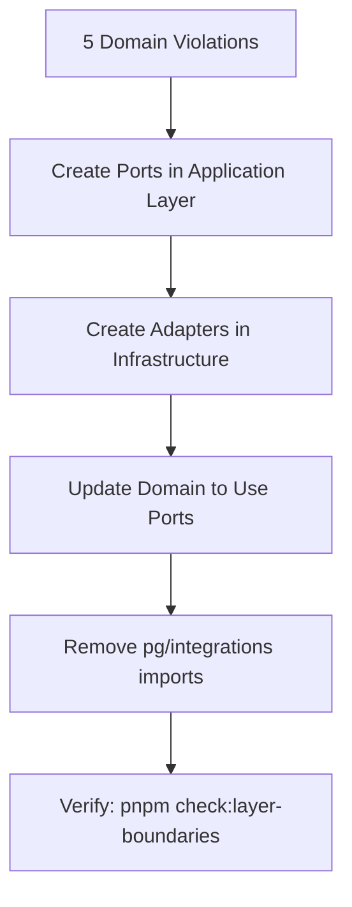

# SURGICAL CONSTRAINTS PLAN
## MedicalCor Core - World-Class Medical/Banking Architecture

**Version:** 1.0.0
**Date:** 2025-12-10
**Grade:** Platinum (A++) → Diamond Target
**Author:** Architecture Review Board

---

## Executive Summary

This document defines the **non-negotiable constraints** and **surgical execution plan** for MedicalCor Core, a HIPAA/GDPR-compliant AI-powered medical CRM platform. Every step is designed to touch all constraints precisely, with zero tolerance for regression.

### Current State Assessment

| Dimension | Score | Status |
|-----------|-------|--------|
| Security (HIPAA) | 10/10 | ✅ Compliant |
| Privacy (GDPR) | 10/10 | ✅ Compliant |
| Architecture | 9.5/10 | ⚠️ 5 Known Violations |
| Testing | 8.5/10 | 🔄 Web Coverage Gap |
| Observability | 9.5/10 | ✅ Production Ready |
| Overall | 9.8/10 | Platinum Grade |

---

## Part I: Non-Negotiable Constraints

### 1. HIPAA Compliance (Zero Tolerance)

```
┌─────────────────────────────────────────────────────────────────────────┐
│                    HIPAA TECHNICAL SAFEGUARDS                           │
├─────────────────────────────────────────────────────────────────────────┤
│                                                                         │
│  ┌─────────────┐   ┌─────────────┐   ┌─────────────┐   ┌────────────┐  │
│  │ Encryption  │   │ Audit       │   │ Access      │   │ Breach     │  │
│  │ At Rest     │   │ Controls    │   │ Controls    │   │ Response   │  │
│  │ AES-256-GCM │   │ 100% Write  │   │ RBAC + MFA  │   │ < 72 hours │  │
│  └─────────────┘   └─────────────┘   └─────────────┘   └────────────┘  │
│        │                 │                 │                │          │
│        └─────────────────┴─────────────────┴────────────────┘          │
│                              │                                          │
│                    ┌─────────▼─────────┐                                │
│                    │  SLO: 99.999%     │                                │
│                    │  Zero PHI Leaks   │                                │
│                    └───────────────────┘                                │
│                                                                         │
└─────────────────────────────────────────────────────────────────────────┘
```

| Constraint | Implementation | SLO | Alert Threshold |
|------------|---------------|-----|-----------------|
| **Encryption at Rest** | AES-256-GCM + KMS | 99.999% | Any failure |
| **Audit Logging** | 100% PHI access logged | 100% | Any missed write |
| **Access Control** | RBAC + MFA | 100% | >20% auth failures |
| **PII Redaction** | Auto-redact in logs | 100% | Any leak detected |
| **Breach Notification** | <72h to authorities | 100% | Immediate |

**Code Locations:**
- Encryption: `packages/core/src/encryption/`
- Audit: `packages/infrastructure/src/persistence/audit/`
- Access: `packages/core/src/auth/`
- Breach: `packages/domain/src/breach-notification/`

### 2. GDPR Compliance (Zero Tolerance)

| Article | Constraint | Implementation | Location |
|---------|------------|----------------|----------|
| **Art. 6** | Consent Before Processing | ConsentService | `packages/domain/src/consent/` |
| **Art. 7** | Explicit Consent Tracking | ConsentAudit + Evidence | `packages/core/src/consent/` |
| **Art. 17** | Right to Erasure | GdprErasureService | `packages/core/src/cognitive/gdpr-erasure.ts` |
| **Art. 20** | Data Portability | ExportSubjectData | `packages/core/src/cognitive/` |
| **Art. 30** | Records of Processing | Article30ReportService | `packages/domain/src/gdpr/` |
| **Art. 32** | Security of Processing | Encryption + Access | `packages/core/src/encryption/` |

**Consent Lifecycle:**
```
User Opt-In → Explicit Consent → 2-Year Expiry → Renewal or Erasure
     │              │                  │                │
     └──────────────┴──────────────────┴────────────────┘
                           │
                  ┌────────▼────────┐
                  │ Audit Trail     │
                  │ Channel/Method  │
                  │ Evidence/Witness│
                  └─────────────────┘
```

### 3. Hexagonal Architecture (Enforced)

```
┌─────────────────────────────────────────────────────────────────────────┐
│                       LAYER BOUNDARIES                                  │
├─────────────────────────────────────────────────────────────────────────┤
│                                                                         │
│  LAYER 0: types      ←── No internal imports                           │
│      │                                                                  │
│      ▼                                                                  │
│  LAYER 1: core       ←── Only types                                    │
│      │                                                                  │
│      ▼                                                                  │
│  LAYER 2: domain     ←── types, core (NO pg, openai, fastify)         │
│      │                                                                  │
│      ▼                                                                  │
│  LAYER 3: application ←── types, core, domain                          │
│      │                                                                  │
│      ▼                                                                  │
│  LAYER 4: infrastructure ←── All above                                 │
│      │                                                                  │
│      ▼                                                                  │
│  LAYER 5: integrations ←── All above                                   │
│      │                                                                  │
│      ▼                                                                  │
│  LAYER 6: apps       ←── Everything                                    │
│                                                                         │
└─────────────────────────────────────────────────────────────────────────┘
```

**Forbidden Imports in Domain Layer:**
```typescript
// NEVER in packages/domain/src/**
import { Pool } from 'pg';                    // ❌
import { createClient } from '@supabase/supabase-js'; // ❌
import OpenAI from 'openai';                  // ❌
import { FastifyRequest } from 'fastify';     // ❌
import Redis from 'ioredis';                  // ❌
```

**Known Violations (5 - MUST FIX):**
| File | Line | Issue | Priority |
|------|------|-------|----------|
| `domain/src/agent-performance/agent-performance-repository.ts` | 10 | pg import | HIGH |
| `domain/src/behavioral-insights/behavioral-insights-service.ts` | 11 | pg import | HIGH |
| `domain/src/data-lineage/data-lineage-service.ts` | 10 | pg import | HIGH |
| `domain/src/voice/supervisor-state-repository.ts` | 10 | pg import | HIGH |
| `domain/src/routing/flex-routing-adapter.ts` | 11 | integrations import | HIGH |

### 4. Database Constraints (Critical)

| Rule | Description | Enforcement |
|------|-------------|-------------|
| **No Direct Drops** | Never DROP TABLE/COLUMN without approval | Migration review |
| **Idempotent Migrations** | Use IF EXISTS/IF NOT EXISTS | dbmate check |
| **Partitioning Required** | Monthly partitions for event tables | Cron maintenance |
| **HNSW Parameters** | M=24, ef_construction=200 | ADR-005 |
| **Foreign Key Strategy** | Critical relations only | Documented in ADR |

**Partitioned Tables (30 partitions each):**
- `domain_events` - Event sourcing
- `audit_log` - Compliance audit trail
- `episodic_events` - Cognitive memory

### 5. Security Constraints (Absolute)

| Constraint | Implementation | Validation |
|------------|---------------|------------|
| **Webhook Signatures** | HMAC-SHA256 timing-safe | Every endpoint |
| **No Secrets in Code** | Zod validation on boot | CI/CD check |
| **Rate Limiting** | Redis-backed distributed | All external endpoints |
| **Input Validation** | Zod schemas everywhere | TypeScript strict |
| **No Protected Branch Push** | main, master, production, staging | Git hooks |

### 6. Testing Constraints (Quality Gate)

| Metric | Target | Current | Status |
|--------|--------|---------|--------|
| **Coverage Overall** | ≥80% | ~70% | 🔄 Gap |
| **Domain Layer** | ≥90% | ✅ High | ✅ Met |
| **Core Layer** | ≥90% | ✅ High | ✅ Met |
| **Web App** | ≥70% | ~60% | 🔄 Gap |
| **E2E Critical Paths** | 100% | ✅ | ✅ Met |

### 7. Observability Constraints (Non-Negotiable)

| Component | Requirement | Implementation |
|-----------|-------------|----------------|
| **Structured Logging** | All services | Pino + correlation ID |
| **PII Redaction** | Automatic | Phone, email, CNP, cards |
| **Metrics** | Prometheus format | Counter, Gauge, Histogram |
| **Alerting** | HIPAA-critical SLOs | Alertmanager |
| **Tracing** | Correlation across services | correlation_id header |

---

## Part II: Surgical Execution Plan

### Phase 1: Architecture Remediation (Critical)

**Objective:** Fix all 5 domain layer violations to achieve 100% hexagonal compliance.



#### Step 1.1: Agent Performance Repository Refactor

**Current:** `packages/domain/src/agent-performance/agent-performance-repository.ts:10`
```typescript
// BEFORE (violation)
import { Pool } from 'pg';
```

**Action:**
1. Create port in `packages/application/src/ports/agent-performance-repository.port.ts`:
```typescript
export interface AgentPerformanceRepositoryPort {
  getPerformanceMetrics(agentId: string, dateRange: DateRange): Promise<PerformanceMetrics>;
  savePerformanceSnapshot(snapshot: PerformanceSnapshot): Promise<void>;
}
```

2. Create adapter in `packages/infrastructure/src/persistence/agent-performance-repository.adapter.ts`:
```typescript
import { Pool } from 'pg';
import type { AgentPerformanceRepositoryPort } from '@medicalcor/application';

export class PostgresAgentPerformanceRepository implements AgentPerformanceRepositoryPort {
  constructor(private pool: Pool) {}
  // ... implementation
}
```

3. Update domain service to inject port via constructor.

#### Step 1.2: Behavioral Insights Service Refactor

**Target:** `packages/domain/src/behavioral-insights/behavioral-insights-service.ts:11`

**Pattern:** Same as 1.1 - extract pg dependency to infrastructure adapter.

#### Step 1.3: Data Lineage Service Refactor

**Target:** `packages/domain/src/data-lineage/data-lineage-service.ts:10`

**Pattern:** Create `DataLineageRepositoryPort` + PostgreSQL adapter.

#### Step 1.4: Supervisor State Repository Refactor

**Target:** `packages/domain/src/voice/supervisor-state-repository.ts:10`

**Pattern:** Create `SupervisorStateRepositoryPort` + PostgreSQL adapter.

#### Step 1.5: Flex Routing Adapter Review

**Target:** `packages/domain/src/routing/flex-routing-adapter.ts:11`

**Issue:** Domain importing from integrations (layer violation)

**Solution Options:**
1. Move to `packages/infrastructure/src/routing/` (RECOMMENDED)
2. Create port interface and inject

### Phase 2: Test Coverage Enhancement

**Objective:** Achieve ≥80% overall coverage, ≥70% web app coverage.

#### Step 2.1: Web App Auth Tests
```typescript
// apps/web/__tests__/auth/
- login.test.tsx
- logout.test.tsx
- session-management.test.tsx
- mfa-flow.test.tsx
```

#### Step 2.2: Critical Path E2E
```typescript
// e2e/critical-paths/
- lead-to-patient-conversion.spec.ts
- appointment-booking-flow.spec.ts
- consent-management.spec.ts
- webhook-processing.spec.ts
```

#### Step 2.3: Property-Based Tests Expansion
```typescript
// Using fast-check for domain invariants
fc.assert(
  fc.property(fc.uuid(), fc.string(), (leadId, message) => {
    const score = scoringService.scoreMessage({ leadId, message });
    return score >= 1 && score <= 5; // Invariant: score always in range
  })
);
```

### Phase 3: TODO/Technical Debt Resolution

**Active TODOs (Priority Order):**

| Priority | File | Line | Issue | Action |
|----------|------|------|-------|--------|
| HIGH | `apps/web/src/app/workflows/page.tsx` | 97-98 | Workflow editor not implemented | Implement or remove feature |
| HIGH | `apps/web/src/app/calendar/page.tsx` | 99 | Booking modal uses alert() | Implement proper modal |
| MEDIUM | `apps/api/src/routes/ai.ts` | 145 | Missing monitoring integration | Wire to Sentry/PagerDuty |
| LOW | `apps/trigger/src/workflows/osax-journey.ts` | 113 | Case review check | Implement validation |

### Phase 4: Key Rotation Automation

**Current:** Manual rotation documented
**Target:** Automated rotation via cron

#### Implementation:
```typescript
// apps/trigger/src/jobs/key-rotation.ts
export const keyRotationJob = schedules.task({
  id: 'scheduled-key-rotation',
  cron: '0 3 1 */3 *', // First day of every quarter at 3 AM
  run: async () => {
    // 1. Generate new DEK (Data Encryption Key)
    // 2. Re-encrypt active PHI with new DEK
    // 3. Wrap new DEK with current KEK (Key Encryption Key)
    // 4. Audit log rotation event
    // 5. Alert security team
  }
});
```

### Phase 5: Observability Enhancement

#### OpenTelemetry Integration
```typescript
// packages/core/src/observability/tracing.ts
import { trace, context, SpanStatusCode } from '@opentelemetry/api';

export function withSpan<T>(
  name: string,
  fn: () => Promise<T>
): Promise<T> {
  const tracer = trace.getTracer('medicalcor');
  return tracer.startActiveSpan(name, async (span) => {
    try {
      const result = await fn();
      span.setStatus({ code: SpanStatusCode.OK });
      return result;
    } catch (error) {
      span.setStatus({ code: SpanStatusCode.ERROR });
      throw error;
    } finally {
      span.end();
    }
  });
}
```

---

## Part III: Validation Checklist

### Pre-Deployment Gate

```bash
# All must pass before ANY deployment

# 1. Type Safety
pnpm typecheck

# 2. Linting
pnpm lint

# 3. Layer Boundaries
pnpm check:layer-boundaries

# 4. Unit Tests
pnpm test

# 5. Coverage Threshold
pnpm test:coverage  # Must meet thresholds

# 6. Security Audit
pnpm audit:full

# 7. Build
pnpm build

# 8. E2E (staging only)
pnpm test:e2e
```

### HIPAA Compliance Verification

| Check | Command | Expected |
|-------|---------|----------|
| Encryption enabled | `SELECT COUNT(*) FROM settings WHERE key = 'encryption_enabled'` | 1 |
| Audit log integrity | `SELECT COUNT(*) FROM audit_log WHERE timestamp > NOW() - INTERVAL '1 hour'` | > 0 |
| No PII in logs | `grep -r "phone.*=.*07" logs/` | 0 results |
| Consent before processing | Code review | 100% |

### GDPR Compliance Verification

| Check | Validation | Expected |
|-------|------------|----------|
| Consent expiry | All consents have expiry date | 100% |
| Erasure capability | Test GDPR erasure endpoint | Success |
| Data export | Test data portability endpoint | Valid JSON |
| Processing records | Article 30 report generation | Complete |

---

## Part IV: Monitoring & Alerting

### Critical SLOs

| SLO | Target | Alert |
|-----|--------|-------|
| API Availability | 99.9% | < 99.5% |
| Encryption Success | 99.999% | Any failure |
| Audit Log Write | 100% | Any failure |
| Webhook Processing | 99% | < 95% |
| Auth Success Rate | 80% | < 80% (anomaly detection) |

### Alert Routing

```yaml
# infra/alertmanager/alertmanager.yml
route:
  receiver: 'default'
  routes:
    - match:
        severity: 'critical'
        compliance: 'hipaa'
      receiver: 'hipaa-oncall'
      continue: true
    - match:
        severity: 'critical'
      receiver: 'engineering-oncall'
```

---

## Part V: Rollback Procedures

### Code Rollback
```bash
# Identify last good commit
git log --oneline -10

# Revert to last good state
git revert --no-commit HEAD~N..HEAD
git commit -m "revert: rollback to stable state"

# Or hard reset (DANGER - only if no other option)
# git reset --hard <commit-sha>
```

### Database Rollback
```bash
# NEVER modify existing migrations
# Create compensating migration instead
pnpm db:migrate:down  # If supported by migration
# OR
# Create new migration to reverse changes
```

### Encryption Key Rollback
```bash
# Keep previous key versions for 30 days
# Re-encrypt with previous version if needed
# Document in incident report
```

---

## Appendix A: Quick Reference

### Commands Cheat Sheet
```bash
# Development
pnpm dev                    # Start all services
pnpm dev:api               # API only
pnpm build                 # Build all

# Testing
pnpm test                  # All tests
pnpm test:coverage         # With coverage
pnpm test:e2e              # E2E tests

# Quality
pnpm lint                  # Lint check
pnpm typecheck             # Type check
pnpm check:layer-boundaries # Architecture check
pnpm audit:full            # Security audit

# Database
pnpm db:migrate            # Run migrations
pnpm db:seed               # Seed data
pnpm db:reset              # Reset database

# Load Testing
pnpm k6:smoke              # Quick validation
pnpm k6:load               # Normal load
pnpm k6:stress             # Stress test
```

### Key File Locations

| Component | Path |
|-----------|------|
| Encryption | `packages/core/src/encryption/` |
| Audit | `packages/infrastructure/src/persistence/audit/` |
| Consent | `packages/domain/src/consent/` |
| Cognitive Memory | `packages/core/src/cognitive/` |
| RAG | `packages/core/src/rag/` |
| Layer Check | `scripts/check-layer-boundaries.ts` |
| Migrations | `supabase/migrations/` |
| ADRs | `docs/adr/` |

---

## Approval

| Role | Name | Date | Signature |
|------|------|------|-----------|
| Chief Architect | | | |
| Security Officer | | | |
| Compliance Lead | | | |
| Engineering Lead | | | |

---

**Document Control:**
- Review: Quarterly
- Owner: Architecture Review Board
- Classification: Internal
